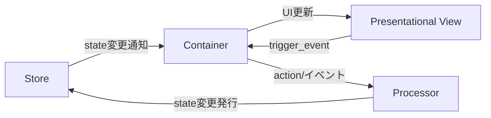

# PubSubTk

軽量な Python ライブラリで、イベント駆動かつ状態管理された GUI アプリケーションを簡単に構築できます。
主な特徴は次のとおりです。

* **UI とビジネスロジックの疎結合** ― Publish/Subscribe (Pub/Sub) により部品間を非同期メッセージで接続し、高凝集・低結合を実現します。
* **Pydantic モデル** による型安全な状態管理で、バリデーションや JSON Schema 出力も自動化。
* **Presentational / Container / Processor** の 3 層分離パターンを標準化。React 界隈で定番の構造を Tkinter アプリに応用しています。
* Pub/Sub を活用した **画面遷移・サブウィンドウ管理** と **リアクティブ UI 更新** をサポート。
* 依存は純粁 Python のみ（`tkinter`, `pypubsub`, `pydantic`）。Tkテーマ変更用に `ttkthemes` も利用可能。

---

## 📦 インストール

```bash
pip install git+https://github.com/vavavavavavavavava/pubsubtk
```

**要件**:

| パッケージ     | 最低バージョン | 備考                            |
| --------- | ------- | ----------------------------- |
| Python    | 3.11    | スレッドセーフな Tk が使える版             |
| pypubsub  | 4.0     | Python 3 系専用  |
| pydantic  | 2.x     | 型安全 & 高速  |
| ttkthemes | 任意      | Tk テーマを適用する場合                 |

---

## 🚀 クイックスタート

`tests/sample_app` ディレクトリには、PubSubTkの基本的な使い方を示すサンプルアプリケーション一式が含まれています。  
このサンプルは「状態モデル」「トピック定義」「プロセッサ」「UIコンポーネント（表示用・コンテナ・サブウィンドウ）」などに分かれており、各ファイルには詳細なdocstringやコメントが記載されています。

主なファイル構成は以下の通りです。

```txt
tests/sample_app/
├── app_state.py                  # アプリケーションの状態モデル（Pydanticベース）の定義
├── app_topics.py                 # カスタムPubSubトピックの定義
├── processors.py                 # ビジネスロジック（Processor）の実装
├── main.py                       # アプリケーションのエントリーポイント
└── ui/
    ├── containers/
    │   └── task_list_container.py      # タスクリスト用コンテナ
    ├── presentational/
    │   └── task_list_view.py          # タスクリスト表示用ビュー
    └── subwindows/
        └── task_detail_window.py      # タスク詳細サブウィンドウ用コンテナ
```

サンプルアプリの起動方法:

```bash
python tests/sample_app/main.py
```

まずはこれらのファイルを参照し、実際にサンプルアプリを動かしてみてください。  
各ファイルのコメントやdocstringを読むことで、設計思想や実装の意図も理解しやすくなっています。

## ✨ コアコンセプトと機能概要

### pubsubtkのコア構造



### 使える便利メソッド

| メソッド                            | 説明                       | 主に利用する層               |
| ------------------------------- | ------------------------ | --------------------- |
| `pub_switch_container(...)`     | メイン画面（Container）を切り替え    | Container / Processor |
| `pub_open_subwindow(...)`       | サブウィンドウを開く               | Container / Processor |
| `pub_close_subwindow(win_id)`   | 指定 ID のサブウィンドウを閉じる       | Container / Processor |
| `pub_close_all_subwindows()`    | サブウィンドウをすべて閉じる           | Container / Processor |
| `pub_update_state(path, value)` | 任意パスの状態を更新               | Processor / Container |
| `pub_add_to_list(path, item)`   | リストに要素を追加                | Processor / Container |
| `pub_registor_processor(...)`   | Processor を動的登録          | Processor             |
| `pub_delete_processor(name)`    | Processor を削除            | Processor             |
| `sub_state_changed(path, h)`    | 値変更を購読                   | Container             |
| `sub_state_added(path, h)`      | 要素追加を購読                  | Container             |
| `sub_state_removed(path, h)`    | 要素削除を購読                  | Container             |
| `register_handler(evt, cb)`     | View イベントのハンドラ登録         | Container             |
| `trigger_event(evt, **k)`       | View → Container へイベント送出 | Presentational        |

---

## 📖 リファレンス

- [フルリファレンス（REFERENCE_FULL.md）](docs/REFERENCE_FULL.md)  
  全コードとその詳細解説（全ソースコード＋設計・補足コメントまで含む完全版）

- [ミディアムリファレンス（REFERENCE_MEDIUM.md）](docs/REFERENCE_MEDIUM.md)  
  各メソッド・関数の「型」や「docstring」のみ抜粋（実装本体なし）。APIや構造の雰囲気をざっと把握したい場合向け

- [ショートリファレンス（REFERENCE_SHORT.md）](docs/REFERENCE_SHORT.md)  
  クイックスタート、利用ルール、よく使うメソッド一覧等を1ページに凝縮した最速チートシート

---

**生成AI（ChatGPTなど）にPubSubTkのコード生成や設計支援を依頼する際は、ぜひこれらのリファレンスを一緒に提示してください。**  
API設計や利用ルールをAIに伝えることで、より正確で実用的なコードやアドバイスを引き出しやすくなります！

---

## 🙌 貢献 & フィードバック

* Issue / PR は GitHub で歓迎しています。
  [https://github.com/vavavavavavavavava/pubsubtk](https://github.com/vavavavavavavavava/pubsubtk)
* ドキュメント改善案やユースケース紹介もお気軽にどうぞ！
