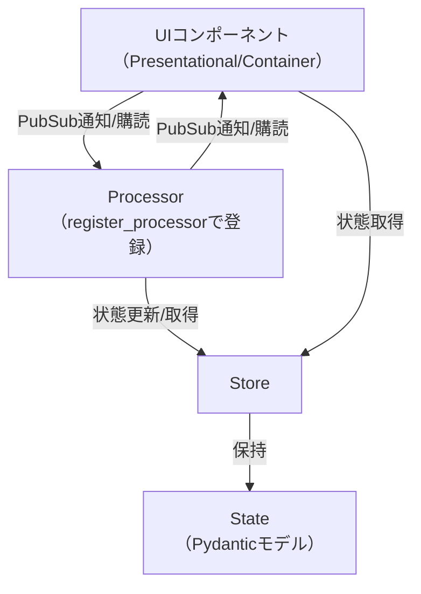

# pubsubtk

**pubsubtk**は、Tkinterと[pypubsub](https://github.com/schollii/pypubsub)を組み合わせた、型安全な状態管理・PubSubアーキテクチャを提供するPythonライブラリです。  
GUIアプリケーションの状態管理・画面遷移・イベント伝播を、シンプルかつ堅牢に実装できます。

## 特徴

- **型安全な状態管理**: Pydanticモデルによる型安全なStore
- **PubSubパターン**: pypubsubによる疎結合なイベント伝播
- **Tkinter/ttk対応**: 標準Tkinterとttkthemes両対応
- **UIコンポーネントの分離**: 表示専用/コンテナ/状態管理の責務分離
- **Processorによるロジック分離**: 任意のProcessorクラスを作成し、`register_processor`で登録することで、PubSubの購読や状態更新などのロジックをUIから分離可能
- **拡張性**: プロセッサやトピックのカスタマイズが容易

## アーキテクチャ関係図



## Storeのstateアクセス方法

- `store.state`: パス表現のプロキシ。`store.state.foo.bar`のようにアクセスすると、`"foo.bar"`というパス文字列を返します。これを`update_state`や`add_to_list`のパス引数として利用できます。
  例: `store.update_state(store.state.count, 1)` のように書くことで、VSCode等のIDEで「定義へ移動」やリファクタリング補助が効き、どのProcessorやUIがどの状態を更新しているかを追跡しやすくなります（従来の文字列パス指定の弱点を解消）。
- `store.get_current_state()`: 現在の状態（Pydanticモデルのインスタンス）をディープコピーで取得します。値の参照や表示に便利です。

## インストール

```sh
pip install poetry
poetry install
```

または、`pyproject.toml`の依存関係を直接pipでインストール:

```sh
pip install pypubsub pydantic ttkthemes
```

## 依存パッケージ

- Python 3.11以上
- [pypubsub](https://pypi.org/project/PyPubSub/)
- [pydantic](https://pydantic-docs.helpmanual.io/)
- [ttkthemes](https://github.com/RedFantom/ttkthemes)

## クイックスタート

### 1. 状態モデルの定義

```python
from pydantic import BaseModel

class AppState(BaseModel):
    count: int = 0
```

### 2. Storeの作成

```python
from pubsubtk.store.store import create_store

store = create_store(AppState)
```

### 3. Processorの作成と登録

```python
from pubsubtk.processor import ProcessorBase, register_processor

class CounterProcessor(ProcessorBase):
    def setup_subscriptions(self):
        # PubSubイベント購読
        self.subscribe("increment", self.on_increment)
    def on_increment(self):
        # store.state.count を使うことでIDE補完や定義ジャンプが効く
        store.update_state(store.state.count, store.get_current_state().count + 1)

register_processor("counter", CounterProcessor)
```

### 4. アプリケーションの作成

```python
from pubsubtk.app import TkApplication

class MyApp(TkApplication):
    def __init__(self):
        super().__init__(title="My PubSubTk App")
```

### 5. UIコンポーネントの作成

```python
from pubsubtk.ui.base.presentaional_base import PresentationalComponentTk

class CounterLabel(PresentationalComponentTk):
    def setup_ui(self):
        self.label = tk.Label(self, text="0")
        self.label.pack()
    def update_data(self, count):
        self.label.config(text=str(count))
```

### 6. PubSub購読・状態更新

```python
from pubsubtk.topic.topics import DefaultUpdateTopic

def on_count_changed(old_value, new_value):
    print(f"Count changed: {old_value} -> {new_value}")

store = create_store(AppState)
# 文字列パスも使えるが、推奨は store.state.count でIDE補完・追跡性を活かす
store.update_state(store.state.count, 1)
```

## API概要

- `Store[TState]`: 型安全な状態管理クラス
- `PubSubBase`: PubSub購読/通知の基底クラス
- `PresentationalComponentTk/Ttk`: 表示専用UIコンポーネント
- `ContainerComponentTk/Ttk`: PubSub購読付きUIコンテナ
- `TkApplication/ThemedApplication`: アプリケーション本体
- `ProcessorBase`, `register_processor`, `delete_processor`: 任意のロジックを担うProcessorの基底・管理API

## ライセンス

本ライブラリは [GNU GPL v3](LICENSE) のもとで公開されています。

---
