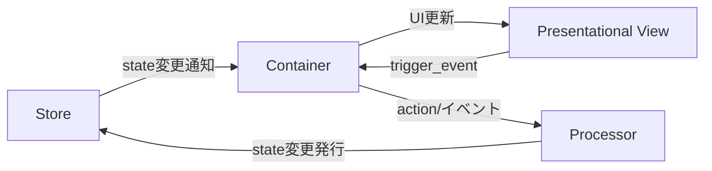

# PubSubTk

**PubSubTk** は、イベント駆動＆状態管理型の Python GUIアプリケーションを、型安全かつ疎結合で構築できる軽量ライブラリです。

主な特徴：

* **UIとビジネスロジックの疎結合** ― Publish/Subscribe（Pub/Sub）で部品間を非同期メッセージ連携
* **Pydanticモデル** による型安全な状態管理。バリデーションや JSON Schema 出力も簡単
* **Container / Presentational / Processor** 3層分離パターンを標準化（Reactスタイルの設計をTkinterでも）
* **Pub/Subによる画面遷移・サブウィンドウ管理**と**リアクティブUI更新**をサポート
* 依存は純正Pythonのみ（`tkinter`, `pypubsub`, `pydantic`）。Tkテーマ変更用に `ttkthemes` も利用可能

---

## 📦 インストール

```bash
pip install git+https://github.com/vavavavavavavavava/pubsubtk
```

**要件:**

| パッケージ     | 最低バージョン | 備考             |
| --------- | ------- | -------------- |
| Python    | 3.11    | スレッドセーフTkが使える版 |
| pypubsub  | 4.0     | Python 3 専用    |
| pydantic  | 2.x     | 型安全＆高速         |
| ttkthemes | 任意      | テーマ適用の場合のみ     |

---

## ✨ コアコンセプト

### 構造イメージ



* **Store**: Pydanticモデルでアプリの状態を一元管理。型安全なアクセス＆更新通知が得られます。
* **Container**: 状態を購読し、UIと連動。ユーザー操作から Processor への橋渡しも担う。
* **Presentational**: 受け取ったデータを表示するだけの純粋View。状態管理・ロジックは一切持たない。
* **Processor**: ビジネスロジック/状態変更を集中管理。PubSub経由でContainer/Storeと通信。

---

## 🚀 クイックスタート

1. **状態モデルをPydanticで定義**
2. **TkApplication/Container/Presentational/Processor**を適切に組み立て
3. **便利メソッド**（下記参照）で状態更新やイベント通知

詳細な導入例は[ショートリファレンス](docs/REFERENCE_SHORT.md)をご参照ください。

---

## 🛠️ 使える便利メソッド一覧

PubSubTk でよく使う主要メソッドの概要です。
IDE補完・型安全・設計思想に沿ったメソッド名に統一されています。

| メソッド                                      | 説明・用途                                 | 主な利用層                 |
| ----------------------------------------- | ------------------------------------- | --------------------- |
| `pub_switch_container(cls, kwargs)`       | メイン画面（Container）を切り替える                | Container / Processor |
| `pub_switch_slot(slot, cls, kwargs)`      | テンプレート内の任意スロットのコンポーネントを切り替え           | Container / Processor |
| `pub_open_subwindow(cls, win_id, kwargs)` | サブウィンドウを開く                            | Container / Processor |
| `pub_close_subwindow(win_id)`             | 指定 ID のサブウィンドウを閉じる                    | Container / Processor |
| `pub_close_all_subwindows()`              | サブウィンドウをすべて閉じる                        | Container / Processor |
| `pub_update_state(path, value)`           | 任意パスの状態を型安全に更新                        | Processor / Container |
| `pub_add_to_list(path, item)`             | リスト要素を型安全に追加                          | Processor / Container |
| `pub_registor_processor(cls, name)`       | Processor を動的に登録                      | Processor             |
| `pub_delete_processor(name)`              | Processor を削除                         | Processor             |
| `sub_state_changed(path, handler)`        | 指定パスの値変更を購読                           | Container             |
| `sub_state_added(path, handler)`          | リストへの要素追加を購読                          | Container             |
| `register_handler(event, cb)`             | PresentationalコンポーネントでViewイベントのハンドラ登録 | Container             |
| `trigger_event(event, **kwargs)`          | View→Containerへ任意イベント送出               | Presentational        |

* **path**: `store.state.xxx` のように型安全なStateProxyを利用（`str()`でパス文字列化も可）
* **handler**: 通常2引数（old\_value, new\_value）など

---

## 📖 リファレンス

* [フルリファレンス（REFERENCE\_FULL.md）](docs/REFERENCE_FULL.md)
  └ 全コードと設計解説の完全版。
* [ショートリファレンス（REFERENCE\_SHORT.md）](docs/REFERENCE_SHORT.md)
  └ クイックスタート・利用ルール・メソッド一覧を凝縮したチートシート。

---

**ChatGPT等でコード生成や設計相談をする際は、上記リファレンスを提示するとAIの理解度＆出力精度が大幅UPします！**

---

## 🙌 貢献・フィードバック

* Issue / PR は GitHub で歓迎！
  [https://github.com/vavavavavavavavava/pubsubtk](https://github.com/vavavavavavavavava/pubsubtk)
* ドキュメント改善案やユースケース紹介もお気軽にどうぞ！

---

ご要望やカスタマイズ相談は Issue まで！
