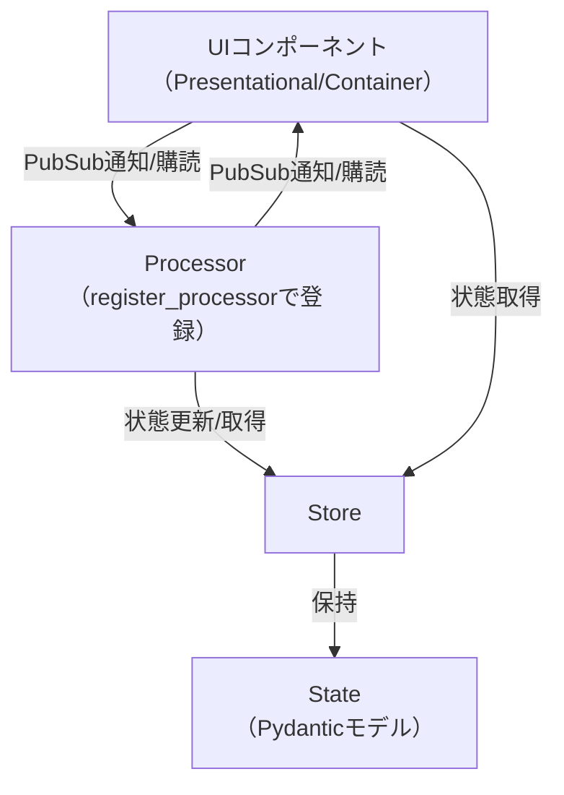

# pubsubtk

**pubsubtk**は、Tkinterと[pypubsub](https://github.com/schollii/pypubsub)を組み合わせた、型安全な状態管理・PubSubアーキテクチャを提供するPythonライブラリです。  
GUIアプリケーションの状態管理・画面遷移・イベント伝播を、シンプルかつ堅牢に実装できます。

## 特徴

- **型安全な状態管理**: Pydanticモデルによる型安全なStore
- **PubSubパターン**: pypubsubによる疎結合なイベント伝播
- **Tkinter/ttk対応**: 標準Tkinterとttkthemes両対応
- **UIコンポーネントの分離**: 表示専用/コンテナ/状態管理の責務分離
- **Processorによるロジック分離**: 任意のProcessorクラスを作成し、`register_processor`で登録することで、PubSubの購読や状態更新などのロジックをUIから分離可能
- **拡張性**: プロセッサやトピックのカスタマイズが容易

## アーキテクチャ関係図



## Storeのstateアクセス方法

- `store.state`: パス表現のプロキシ。`store.state.foo.bar`のようにアクセスすると、`"foo.bar"`というパス文字列を返します。これを`update_state`や`add_to_list`のパス引数として利用できます。
  例: `store.update_state(store.state.count, 1)` のように書くことで、VSCode等のIDEで「定義へ移動」やリファクタリング補助が効き、どのProcessorやUIがどの状態を更新しているかを追跡しやすくなります（従来の文字列パス指定の弱点を解消）。
- `store.get_current_state()`: 現在の状態（Pydanticモデルのインスタンス）をディープコピーで取得します。値の参照や表示に便利です。

## インストール

```bash
pip install git+https://github.com/vavavavavavavavava/pubsubtk
```

## 依存パッケージ

- Python 3.11以上
- [pypubsub](https://pypi.org/project/PyPubSub/)
- [pydantic](https://pydantic-docs.helpmanual.io/)
- [ttkthemes](https://github.com/RedFantom/ttkthemes)

## クイックスタート

### 0. プロジェクト構造

```txt
my_app/
├── app_state.py     # アプリケーション状態の定義
├── app_topics.py    # カスタムトピックの定義
├── processors.py    # プロセッサの定義
├── ui/
│   ├── components.py  # 表示専用コンポーネント
│   └── containers.py  # コンテナコンポーネント
└── main.py          # エントリーポイント
```

### 1. 状態モデルの定義 (app_state.py)

```python
from typing import List, Optional

from pydantic import BaseModel


class TaskItem(BaseModel):
    id: int
    title: str
    completed: bool = False


class AppState(BaseModel):
    tasks: List[TaskItem] = []
    counter: int = 0
    selected_task_id: Optional[int] = None
```

### 2. カスタムトピックの定義 (app_topics.py)

```python
from enum import auto

from pubsubtk import AutoNamedTopic


class TaskTopic(AutoNamedTopic):
    """タスク操作用のカスタムトピック"""

    ADD_TASK = auto()
    TOGGLE_TASK = auto()
    SELECT_TASK = auto()
    DELETE_TASK = auto()

```

### 3. プロセッサの作成と登録 (processors.py)

```python
from pubsubtk import ProcessorBase

from app_state import AppState, TaskItem
from app_topics import TaskTopic


class TaskProcessor(ProcessorBase[AppState]):
    def setup_subscriptions(self):
        self.subscribe(TaskTopic.ADD_TASK, self.on_add_task)
        self.subscribe(TaskTopic.TOGGLE_TASK, self.on_toggle_task)
        self.subscribe(TaskTopic.SELECT_TASK, self.on_select_task)
        self.subscribe(TaskTopic.DELETE_TASK, self.on_delete_task)

    def on_add_task(self, title: str):
        state = self.store.get_current_state()

        # 新しいIDを生成
        next_id = state.counter + 1

        # カウンターを更新
        self.store.update_state(self.store.state.counter, next_id)

        # 新しいタスクを作成
        new_task = TaskItem(id=next_id, title=title)

        # タスクをリストに追加
        self.store.add_to_list(self.store.state.tasks, new_task)

    def on_toggle_task(self, task_id: int):
        state = self.store.get_current_state()

        for i, task in enumerate(state.tasks):
            if task.id == task_id:
                # タスクの状態を反転
                updated_task = task.model_copy()
                updated_task.completed = not task.completed

                # リストの特定位置を更新
                tasks = state.tasks.copy()
                tasks[i] = updated_task
                self.store.update_state(self.store.state.tasks, tasks)
                break

    def on_select_task(self, task_id: int):
        self.store.update_state(self.store.state.selected_task_id, task_id)

    def on_delete_task(self, task_id: int):
        state = self.store.get_current_state()

        # 特定IDのタスクを除外した新しいリストを作成
        updated_tasks = [task for task in state.tasks if task.id != task_id]
        self.store.update_state(self.store.state.tasks, updated_tasks)
```

### 4. UIコンポーネントの作成

#### 4.1 表示専用コンポーネント (ui/components.py)

```python
import tkinter as tk
from typing import List, Optional

from pydantic import BaseModel

from pubsubtk import PresentationalComponentTk


class TaskItem(BaseModel):
    id: int
    title: str
    completed: bool = False


class TaskItemView(PresentationalComponentTk):
    def setup_ui(self):
        self.var_completed = tk.BooleanVar()

        self.check = tk.Checkbutton(
            self, variable=self.var_completed, command=self._on_toggle
        )
        self.check.pack(side=tk.LEFT)

        self.label = tk.Label(self, text="", width=20, anchor="w")
        self.label.pack(side=tk.LEFT, padx=5)

        self.delete_btn = tk.Button(self, text="削除", command=self._on_delete)
        self.delete_btn.pack(side=tk.RIGHT)

        # 選択状態の表示用
        self.selected_indicator = tk.Label(self, text="→", width=2)
        self.selected_indicator.pack(side=tk.LEFT)
        self.is_selected = False

    def update_data(self, task: TaskItem, is_selected: bool = False):
        self.task_id = task.id
        self.var_completed.set(task.completed)
        self.label.config(text=task.title)

        # 選択状態の更新
        self.is_selected = is_selected
        if is_selected:
            self.selected_indicator.config(text="→")
            self.config(background="#e0e0ff")
        else:
            self.selected_indicator.config(text="")
            self.config(background="SystemButtonFace")

    def _on_toggle(self):
        self.trigger_event("toggle", task_id=self.task_id)

    def _on_delete(self):
        self.trigger_event("delete", task_id=self.task_id)


class TaskListView(PresentationalComponentTk):
    def setup_ui(self):
        self.frame = tk.Frame(self)
        self.frame.pack(fill=tk.BOTH, expand=True)

        self.task_views = []

    def update_data(self, tasks: List[TaskItem], selected_id: Optional[int] = None):
        # 既存のタスクビューをクリア
        for view in self.task_views:
            view.destroy()
        self.task_views = []

        # タスクごとに新しいビューを作成
        for task in tasks:
            is_selected = selected_id == task.id
            view = TaskItemView(self.frame)
            view.update_data(task, is_selected)
            view.pack(fill=tk.X, pady=2)

            # イベントハンドラを登録
            view.register_handler(
                "toggle", lambda task_id: self.trigger_event("toggle", task_id=task_id)
            )
            view.register_handler(
                "delete", lambda task_id: self.trigger_event("delete", task_id=task_id)
            )

            # クリック時のイベント
            view.bind(
                "<Button-1>",
                lambda e, tid=task.id: self.trigger_event("select", task_id=tid),
            )

            self.task_views.append(view)
```

#### 4.2 コンテナコンポーネント (ui/containers.py)

```python
import tkinter as tk

from app_state import AppState
from app_topics import TaskTopic
from ui.components import TaskListView

from pubsubtk import ContainerComponentTk


class TaskListContainer(ContainerComponentTk[AppState]):
    def setup_ui(self):
        self.label = tk.Label(self, text="タスク一覧", font=("", 16))
        self.label.pack(pady=10)

        # 入力フォーム
        self.input_frame = tk.Frame(self)
        self.input_frame.pack(fill=tk.X, padx=10, pady=5)

        self.entry = tk.Entry(self.input_frame, width=30)
        self.entry.pack(side=tk.LEFT, padx=5)
        self.entry.bind("<Return>", self._on_add)

        self.add_btn = tk.Button(self.input_frame, text="追加", command=self._on_add)
        self.add_btn.pack(side=tk.LEFT)

        # タスクリスト
        self.task_list = TaskListView(self)
        self.task_list.pack(fill=tk.BOTH, expand=True, padx=10, pady=10)

        # イベントハンドラの登録
        self.task_list.register_handler("toggle", self._on_toggle_task)
        self.task_list.register_handler("delete", self._on_delete_task)
        self.task_list.register_handler("select", self._on_select_task)

    def setup_subscriptions(self):
        # 状態変更の購読
        self.sub_state_changed(
            self.store.state.tasks,
            self._on_changed,
        )
        self.sub_state_changed(
            self.store.state.selected_task_id,
            self._on_changed,
        )
        self.sub_state_added(
            self.store.state.tasks,
            self._on_added,
        )

    def refresh_from_state(self):
        state = self.store.get_current_state()
        self.task_list.update_data(state.tasks, state.selected_task_id)

    def _on_added(self, item, index):
        # 状態から最新のタスクリストを取得して表示を更新
        self.refresh_from_state()

    def _on_changed(self, old_value, new_value):
        # 選択状態が変わったので表示を更新
        self.refresh_from_state()

    def _on_add(self, event=None):
        task_title = self.entry.get().strip()
        if task_title:
            # TaskTopicメッセージを送信
            self.publish(TaskTopic.ADD_TASK, title=task_title)
            self.entry.delete(0, tk.END)  # 入力欄をクリア

    def _on_toggle_task(self, task_id):
        self.publish(TaskTopic.TOGGLE_TASK, task_id=task_id)

    def _on_delete_task(self, task_id):
        self.publish(TaskTopic.DELETE_TASK, task_id=task_id)

    def _on_select_task(self, task_id):
        self.publish(TaskTopic.SELECT_TASK, task_id=task_id)
```

### 5. エントリーポイント (main.py)

```python
from app_state import AppState
from processors import TaskProcessor
from ui.containers import TaskListContainer

from pubsubtk import (
    TkApplication,
)


def main():
    # アプリケーションのインスタンスを作成し、状態クラスを渡す
    app = TkApplication(state_cls=AppState)

    # TaskProcessorをアプリケーションに登録
    app.register_processor(TaskProcessor)

    # アプリケーション開始時に表示するコンテナを設定
    app.switch_container(TaskListContainer)

    # アプリケーションのメインループを開始
    app.run()


if __name__ == "__main__":
    main()
```

## API概要

- `Store[TState]`, `get_store`: 型安全な状態管理クラス
- `AutoNamedTopic`: メンバー名を小文字化し、クラス名をプレフィックスとするトピック列挙型。
- `PresentationalComponentTk/Ttk`: 表示専用UIコンポーネント
- `ContainerComponentTk/Ttk`: PubSub購読付きUIコンテナ
- `TkApplication/ThemedApplication`: アプリケーション本体
- `ProcessorBase`: 任意のロジックを担うProcessorの基底

## ライセンス

本ライブラリは [GNU GPL v3](LICENSE) のもとで公開されています。

---
