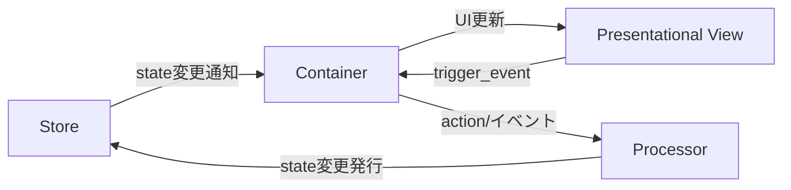

# PubSubTk ライブラリ - 完全リファレンスガイド

## 目次

- [PubSubTk ライブラリ - 完全リファレンスガイド](#pubsubtk-ライブラリ---完全リファレンスガイド)
  - [目次](#目次)
  - [概要](#概要)
  - [主な特徴](#主な特徴)
  - [アーキテクチャ概要](#アーキテクチャ概要)
    - [構造イメージ](#構造イメージ)
    - [各コンポーネントの役割](#各コンポーネントの役割)
  - [🎯 推奨インポートパターン](#-推奨インポートパターン)
  - [主要メソッド一覧](#主要メソッド一覧)
  - [開発のポイント](#開発のポイント)
    - [StateProxyによるIDE連携](#stateproxyによるide連携)
    - [コンポーネント設計指針](#コンポーネント設計指針)
    - [カスタムトピック・PubSub拡張](#カスタムトピックpubsub拡張)
    - [よくある問題と解決法](#よくある問題と解決法)
  - [実践例](#実践例)
    - [全機能を活用したシンプルなカウンターアプリ](#全機能を活用したシンプルなカウンターアプリ)
  - [フルソースコード](#フルソースコード)
    - [コアPubSubシステム](#コアpubsubシステム)
      - [`src/pubsubtk/core/pubsub_base.py`](#srcpubsubtkcorepubsub_basepy)
      - [`src/pubsubtk/core/default_topic_base.py`](#srcpubsubtkcoredefault_topic_basepy)
    - [トピックシステム](#トピックシステム)
      - [`src/pubsubtk/topic/topics.py`](#srcpubsubtktopictopicspy)
    - [State管理](#state管理)
      - [`src/pubsubtk/store/store.py`](#srcpubsubtkstorestorepy)
    - [アプリケーションクラス](#アプリケーションクラス)
      - [`src/pubsubtk/app/application_base.py`](#srcpubsubtkappapplication_basepy)
    - [UIコンポーネント](#uiコンポーネント)
      - [`src/pubsubtk/ui/base/container_base.py`](#srcpubsubtkuibasecontainer_basepy)
      - [`src/pubsubtk/ui/base/presentational_base.py`](#srcpubsubtkuibasepresentational_basepy)
      - [`src/pubsubtk/ui/base/template_base.py`](#srcpubsubtkuibasetemplate_basepy)
    - [Processorシステム](#processorシステム)
      - [`src/pubsubtk/processor/processor_base.py`](#srcpubsubtkprocessorprocessor_basepy)

## 概要

PubSubTk は、Pydantic を用いた型安全な状態管理と、Publish-Subscribe パターンを組み合わせて、Tkinter/ttk を使った GUI アプリケーションをシンプルに構築できる Python ライブラリです。

## 主な特徴

- **UIとビジネスロジックの疎結合** ― Publish/Subscribe（Pub/Sub）で部品間を非同期メッセージ連携
- **Pydanticモデル** による型安全な状態管理。バリデーションや JSON Schema 出力も簡単
- **Container / Presentational / Processor** 3層分離パターンを標準化（Reactスタイルの設計をTkinterでも）
- **Pub/Subによる画面遷移・サブウィンドウ管理**と**リアクティブUI更新**をサポート
- 依存は純正Pythonのみ（`tkinter`, `pypubsub`, `pydantic`）。Tkテーマ変更用に `ttkthemes` も利用可能

---

## アーキテクチャ概要

### 構造イメージ



### 各コンポーネントの役割

- **Store**: Pydanticモデルでアプリの状態を一元管理。型安全なアクセス＆更新通知が得られます。
- **Container**: 状態を購読し、UIと連動。ユーザー操作から Processor への橋渡しも担う。
- **Presentational**: 受け取ったデータを表示するだけの純粋View。状態管理・ロジックは一切持たない。
- **Processor**: ビジネスロジック/状態変更を集中管理。PubSub経由でContainer/Storeと通信。

---

## 🎯 推奨インポートパターン

```python
from pubsubtk import (
    TkApplication, ThemedApplication,           # アプリケーション
    ContainerComponentTk, ContainerComponentTtk, # コンテナ
    PresentationalComponentTk, PresentationalComponentTtk, # プレゼンテーション
    ProcessorBase,                              # プロセッサ
)
from pydantic import BaseModel
from typing import List, Optional, Dict, Any
import tkinter as tk
from tkinter import ttk
```

---

## 主要メソッド一覧

| メソッド                                      | 説明・用途                                 | 主な利用層                 |
| ----------------------------------------- | ------------------------------------- | --------------------- |
| `pub_switch_container(cls, kwargs)`       | メイン画面（Container）を切り替える                | Container / Processor |
| `pub_switch_slot(slot_name, cls, kwargs)` | テンプレート内の任意スロットのコンポーネントを切り替え           | Container / Processor |
| `pub_open_subwindow(cls, win_id, kwargs)` | サブウィンドウを開く                            | Container / Processor |
| `pub_close_subwindow(win_id)`             | 指定 ID のサブウィンドウを閉じる                    | Container / Processor |
| `pub_close_all_subwindows()`              | サブウィンドウをすべて閉じる                        | Container / Processor |
| `pub_replace_state(new_state)`            | 状態オブジェクト全体を置き換える                      | Processor / Container |
| `pub_update_state(state_path, new_value)` | 任意パスの状態を型安全に更新                        | Processor / Container |
| `pub_add_to_list(state_path, item)`       | リスト要素を型安全に追加                          | Processor / Container |
| `pub_add_to_dict(state_path, key, value)` | 辞書要素を型安全に追加                           | Processor / Container |
| `pub_register_processor(proc, name)`      | Processor を動的に登録                      | Processor             |
| `pub_delete_processor(name)`              | Processor を削除                         | Processor             |
| `sub_state_changed(state_path, handler)`  | 指定パスの値変更を購読（old_value, new_value受信）   | Container             |
| `sub_for_refresh(state_path, handler)`    | 状態更新時のUI再描画用シンプル通知を購読（引数なし）         | Container             |
| `sub_state_added(state_path, handler)`    | リストへの要素追加を購読（item, index受信）         | Container             |
| `sub_dict_item_added(state_path, handler)` | 辞書への要素追加を購読（key, value受信）            | Container             |
| `register_handler(event, cb)`             | PresentationalコンポーネントでViewイベントのハンドラ登録 | Container             |
| `trigger_event(event, **kwargs)`          | View→Containerへ任意イベント送出               | Presentational        |

---

## 開発のポイント

### StateProxyによるIDE連携

PubSubTkの最大の価値は、StateProxyによる強力なIDE連携です。

```python
# VSCode/PyCharmで以下が全て効く：
self.store.state.user.name
#            ↑     ↑
#    Ctrl+Click   Ctrl+Click
#    で定義へ     で定義へ

# ✅ F12: 定義へ移動
# ✅ Shift+F12: すべての参照を検索  
# ✅ F2: 安全なリネーム
# ✅ Ctrl+Space: 自動補完
```

**str()が必要なタイミング：**

```python
# ✅ 基本的な使用（str()不要）
self.pub_update_state(self.store.state.counter, 42)
self.sub_state_changed(self.store.state.todos, self.on_todos_changed)

# ✅ 文字列操作が必要な場合のみstr()を使用
path = str(self.store.state.user.name) + "_backup"
self.pub_update_state(f"todos.{index}", updated_todo)
```

### コンポーネント設計指針

**Container** - 状態に依存する処理、ユーザー操作のハンドリング

```python
class TodoContainer(ContainerComponentTk[AppState]):
    def setup_subscriptions(self):
        self.sub_state_changed(self.store.state.todos, self.on_todos_changed)

    def add_todo(self):
        # 状態更新
        self.pub_add_to_list(self.store.state.todos, new_todo)
```

**備考:** コンポーネントの ``__init__`` では与えられた ``*args`` と ``**kwargs`` が
``self.args`` / ``self.kwargs`` として保持されます。サブウィンドウを ``open_subwindow``
で開く場合は ``win_id`` が ``self.kwargs`` に自動追加され、
``pub_close_subwindow(self.kwargs["win_id"])`` で自身を閉じられます。今後も同様の
デフォルト引数が追加される可能性があります。

**Presentational** - 純粋な表示、再利用可能な部品

```python
class TodoItemView(PresentationalComponentTk):
    def update_data(self, todo_item: TodoItem):
        self.label.config(text=todo_item.text)
    
    def on_click(self):
        # Container側にイベント通知
        self.trigger_event("toggle", todo_id=self.todo_item.id)
```

**Template** - レイアウト構造の定義、スロットベースの画面構成

```python
class AppTemplate(TemplateComponentTk[AppState]):
    def define_slots(self):
        # 各領域を定義・配置
        self.header = tk.Frame(self, height=60)
        self.header.pack(fill=tk.X)
        
        self.main = tk.Frame(self)
        self.main.pack(fill=tk.BOTH, expand=True)
        
        self.sidebar = tk.Frame(self, width=200)
        self.sidebar.pack(side=tk.RIGHT, fill=tk.Y)
        
        return {
            "header": self.header,
            "main": self.main,
            "sidebar": self.sidebar
        }

# 使用例
app.set_template(AppTemplate)
app.pub_switch_slot("header", HeaderView)
app.pub_switch_slot("sidebar", NavigationPanel)
```

**Processor** - ビジネスロジック、複雑な状態操作

```python
class TodoProcessor(ProcessorBase[AppState]):
    def setup_subscriptions(self):
        self.subscribe("todo.bulk_update", self.handle_bulk_update)
    
    def handle_bulk_update(self, todo_ids: List[int]):
        # 複雑なロジック処理
        pass
```

### カスタムトピック・PubSub拡張

**AutoNamedTopicによるカスタムトピック作成**:

```python
from pubsubtk import AutoNamedTopic
from enum import auto

class MyAppTopic(AutoNamedTopic):
    USER_LOGIN = auto()        # -> "MyAppTopic.user_login"
    DATA_LOADED = auto()       # -> "MyAppTopic.data_loaded"
    ERROR_OCCURRED = auto()    # -> "MyAppTopic.error_occurred"
    FILE_EXPORT = auto()       # -> "MyAppTopic.file_export"

# 使用例
class MyProcessor(ProcessorBase[AppState]):
    def setup_subscriptions(self):
        self.subscribe(MyAppTopic.USER_LOGIN, self.handle_user_login)
        self.subscribe(MyAppTopic.DATA_LOADED, self.handle_data_loaded)
    
    def some_action(self):
        # カスタムトピックでメッセージ送信
        self.publish(MyAppTopic.FILE_EXPORT, format="csv", filename="data.csv")
```

**デフォルトトピック vs カスタムトピックの使い分け**:

```python
# ✅ デフォルト便利メソッドを使用（推奨）
self.pub_update_state(self.store.state.count, 42)      # 状態更新
self.pub_switch_container(NewContainer)                # 画面切り替え
self.pub_open_subwindow(DialogContainer)               # サブウィンドウ

# ✅ カスタムトピックを使用（ビジネスロジック特有の通信）
self.publish(MyAppTopic.USER_LOGIN, user_id=123)       # アプリ固有のイベント
self.subscribe(MyAppTopic.DATA_LOADED, self.on_data)   # 複雑なワークフロー
```

### よくある問題と解決法

**StateProxy使用時のエラー**:

```python
# ❌ エラーになる例
path = self.store.state.user.name.replace("old", "new")  # AttributeError

# ✅ 正しい使い方
path = str(self.store.state.user.name).replace("old", "new")
```

**便利メソッドの活用**:

```python
# ✅ 推奨: 組み込みメソッドを使用
self.pub_update_state(self.store.state.count, 42)
self.pub_switch_container(OtherContainer)

# ❌ 非推奨: 手動でトピック操作
self.publish(DefaultUpdateTopic.UPDATE_STATE, state_path="count", new_value=42)
```

---

## 実践例

### 全機能を活用したシンプルなカウンターアプリ

```python
"""
tests/sample_app/main.py

簡易デモアプリケーション
"""

import asyncio
import tkinter as tk
from enum import auto
from tkinter import messagebox

from pydantic import BaseModel

from pubsubtk import (
    AutoNamedTopic,
    ContainerComponentTk,
    PresentationalComponentTk,
    ProcessorBase,
    TemplateComponentTk,
    TkApplication,
    make_async_task,
)


# カスタムトピック定義
class AppTopic(AutoNamedTopic):
    INCREMENT = auto()  # -> "AppTopic.increment"
    RESET = auto()  # -> "AppTopic.reset"
    MILESTONE = auto()  # -> "AppTopic.milestone"


class AppState(BaseModel):
    counter: int = 0
    total_clicks: int = 0


# テンプレート定義
class AppTemplate(TemplateComponentTk[AppState]):
    def define_slots(self):
        # ヘッダー
        self.header = tk.Frame(self, height=50, bg="lightblue")
        self.header.pack(fill=tk.X)

        # メインコンテンツ
        self.main = tk.Frame(self)
        self.main.pack(fill=tk.BOTH, expand=True)

        return {
            "header": self.header,
            "main": self.main,
        }


# Presentationalコンポーネント（ヘッダー表示）
class HeaderView(PresentationalComponentTk):
    def setup_ui(self):
        self.label = tk.Label(
            self, text="PubSubTk Demo", font=("Arial", 16), bg="lightblue"
        )
        self.label.pack(pady=10)

    def update_data(self, total_clicks: int):
        self.label.config(text=f"PubSubTk Demo - Total Clicks: {total_clicks}")


# Containerコンポーネント（ヘッダー管理） - sub_for_refreshを使用
class HeaderContainer(ContainerComponentTk[AppState]):
    def setup_ui(self):
        self.header_view = HeaderView(self)
        self.header_view.pack(fill=tk.BOTH, expand=True)

    def setup_subscriptions(self):
        # 新しいsub_for_refreshを使用 - 引数なしでシンプル
        self.sub_for_refresh(self.store.state.total_clicks, self.refresh_from_state)

    def refresh_from_state(self):
        self.refresh_header()

    def refresh_header(self):
        """引数なしのハンドラー - 必要に応じてstore.get_current_state()で現在値を取得"""
        state = self.store.get_current_state()
        self.header_view.update_data(state.total_clicks)


# Containerコンポーネント（メインカウンター） - 従来のsub_state_changedも併用
class CounterContainer(ContainerComponentTk[AppState]):
    """カウンター表示とアイテム削除を管理するコンテナ。"""

    def setup_ui(self):
        # カウンター表示
        self.counter_label = tk.Label(self, text="0", font=("Arial", 32))
        self.counter_label.pack(pady=30)

        # アイテムリスト
        self.item_list = tk.Listbox(self, height=5)
        for i in range(5):
            self.item_list.insert(tk.END, f"Item {i + 1}")
        self.item_list.pack(pady=10)

        # ボタン
        btn_frame = tk.Frame(self)
        btn_frame.pack(pady=20)

        tk.Button(
            btn_frame, text="カウントアップ", command=self.increment, font=("Arial", 12)
        ).pack(side=tk.LEFT, padx=10)
        tk.Button(
            btn_frame, text="リセット", command=self.reset, font=("Arial", 12)
        ).pack(side=tk.LEFT, padx=10)
        tk.Button(
            btn_frame, text="削除", command=self.delete_selected, font=("Arial", 12)
        ).pack(side=tk.LEFT, padx=10)
        tk.Button(
            btn_frame,
            text="サブウィンドウ",
            command=self.open_subwindow,
            font=("Arial", 12),
        ).pack(side=tk.LEFT, padx=10)

    def setup_subscriptions(self):
        # 2つの方法を比較
        # 1. 従来の方法（old_value, new_valueを受け取るが使わない）
        self.sub_state_changed(
            self.store.state.counter, self.on_counter_changed_old_way
        )

        # 2. 新しい方法（引数なしでシンプル）
        # self.sub_for_refresh(self.store.state.counter, self.on_counter_refresh_new_way)

        self.subscribe(AppTopic.MILESTONE, self.on_milestone)

    def refresh_from_state(self):
        state = self.store.get_current_state()
        self.counter_label.config(text=str(state.counter))

    def increment(self):
        # カスタムトピックでインクリメント通知
        self.publish(AppTopic.INCREMENT)

    def reset(self):
        # カスタムトピックでリセット通知
        self.publish(AppTopic.RESET)

    def delete_selected(self) -> None:
        """選択アイテムの削除処理を開始する。"""
        self.confirm_delete()

    @make_async_task
    async def confirm_delete(self) -> None:
        """削除確認後にリストからアイテムを除去する。"""

        await asyncio.sleep(0)
        selection = self.item_list.curselection()
        if not selection:
            return
        if messagebox.askyesno("確認", "選択項目を削除しますか？"):
            self.item_list.delete(selection[0])

    def on_counter_changed_old_way(self, old_value, new_value):
        """従来の方法 - old_value, new_valueを受け取るが実際は new_value しか使わない"""
        self.counter_label.config(text=str(new_value))

    def on_counter_refresh_new_way(self):
        """新しい方法 - 引数なしでシンプル、必要に応じてstoreから現在値を取得"""
        state = self.store.get_current_state()
        self.counter_label.config(text=str(state.counter))

    def on_milestone(self, value: int):
        messagebox.showinfo("マイルストーン!", f"{value} に到達しました！")

    def open_subwindow(self) -> None:
        """サブウィンドウを表示する。"""
        self.pub_open_subwindow(SubWindow)


# サブウィンドウ用コンテナ
class SubWindow(ContainerComponentTk[AppState]):
    """単純なサブウィンドウ。"""

    def setup_ui(self) -> None:
        tk.Label(self, text="サブウィンドウです").pack(padx=20, pady=10)
        tk.Button(self, text="閉じる", command=self.close_window).pack(pady=10)

    def setup_subscriptions(self):
        pass

    def refresh_from_state(self):
        pass

    def close_window(self) -> None:
        """自身を閉じる。"""
        self.pub_close_subwindow(self.kwargs["win_id"])


# Processor（ビジネスロジック）
class CounterProcessor(ProcessorBase[AppState]):
    def setup_subscriptions(self):
        self.subscribe(AppTopic.INCREMENT, self.handle_increment)
        self.subscribe(AppTopic.RESET, self.handle_reset)

    def handle_increment(self):
        state = self.store.get_current_state()
        new_counter = state.counter + 1
        new_total = state.total_clicks + 1

        # StateProxyで型安全な状態更新
        self.pub_update_state(self.store.state.counter, new_counter)
        self.pub_update_state(self.store.state.total_clicks, new_total)

        # マイルストーン判定
        if new_counter % 10 == 0:
            self.publish(AppTopic.MILESTONE, value=new_counter)

    def handle_reset(self):
        # 便利メソッドで状態リセット
        self.pub_update_state(self.store.state.counter, 0)


if __name__ == "__main__":
    app = TkApplication(AppState, title="PubSubTk Simple Demo", geometry="500x400")
    # Processor登録
    app.pub_register_processor(CounterProcessor)

    # テンプレート設定
    app.set_template(AppTemplate)

    # 各スロットにコンポーネント配置
    app.pub_switch_slot("header", HeaderContainer)
    app.pub_switch_slot("main", CounterContainer)

    # 起動
    app.run(use_async=True)
```

---

## フルソースコード

### コアPubSubシステム

#### `src/pubsubtk/core/pubsub_base.py`

```python
# pubsub_base.py - PubSub 基底クラス

"""Pub/Sub パターンの共通機能をまとめた抽象基底クラス。"""

import logging
from abc import ABC, abstractmethod
from typing import Any, Callable, Dict, List

from pubsub import pub

# PubSub専用のロガーを作成
_pubsub_logger = logging.getLogger("pubsubtk.pubsub")


class PubSubBase(ABC):
    """
    PubSubパターンの基底クラス。

    - setup_subscriptions()で購読設定を行う抽象メソッドを提供
    - subscribe()/send_message()/unsubscribe()/unsubscribe_all()で購読管理
    - teardown()で全購読解除
    - 継承先で購読設定を簡潔に記述可能
    - DEBUGレベルでPubSub操作をログ出力
    """

    def __init__(self, *args, **kwargs):
        self._subscriptions: List[Dict[str, Any]] = []
        self.setup_subscriptions()

    def subscribe(self, topic: str, handler: Callable, **kwargs) -> None:
        pub.subscribe(handler, topic, **kwargs)
        self._subscriptions.append({"topic": topic, "handler": handler})

        # DEBUGログ：購読登録
        _pubsub_logger.debug(
            f"SUBSCRIBE: {self.__class__.__name__} -> topic='{topic}', handler={handler.__name__}"
        )

    def publish(self, topic: str, **kwargs) -> None:
        # DEBUGログ：パブリッシュ（引数も表示）
        args_str = ", ".join(f"{k}={v}" for k, v in kwargs.items())
        _pubsub_logger.debug(
            f"PUBLISH: {self.__class__.__name__} -> topic='{topic}'"
            + (f" with args: {args_str}" if args_str else "")
        )

        pub.sendMessage(topic, **kwargs)

    def unsubscribe(self, topic: str, handler: Callable) -> None:
        pub.unsubscribe(handler, topic)
        self._subscriptions = [
            s
            for s in self._subscriptions
            if not (s["topic"] == topic and s["handler"] == handler)
        ]

        # DEBUGログ：購読解除
        _pubsub_logger.debug(
            f"UNSUBSCRIBE: {self.__class__.__name__} -> topic='{topic}', handler={handler.__name__}"
        )

    def unsubscribe_all(self) -> None:
        # DEBUGログ：全購読解除
        if self._subscriptions:
            _pubsub_logger.debug(
                f"UNSUBSCRIBE_ALL: {self.__class__.__name__} -> {len(self._subscriptions)} subscriptions"
            )

        for s in list(self._subscriptions):
            pub.unsubscribe(s["handler"], s["topic"])
        self._subscriptions.clear()

    @abstractmethod
    def setup_subscriptions(self) -> None:
        """
        継承先で購読設定を行うためのメソッド。

        例:
            class MyPS(PubSubBase):
                def setup_subscriptions(self):
                    self.subscribe(TopicEnum.STATE_CHANGED, self.on_change)
        """
        pass

    def teardown(self) -> None:
        """
        全ての購読を解除する。
        """
        self.unsubscribe_all()


# デバッグログを有効化するユーティリティ関数
def enable_pubsub_debug_logging(level: int = logging.DEBUG) -> None:
    """
    PubSubのデバッグログを有効化する。

    Args:
        level: ログレベル（デフォルト: DEBUG）

    使用例:
        from pubsubtk.core.pubsub_base import enable_pubsub_debug_logging
        enable_pubsub_debug_logging()
    """
    _pubsub_logger.setLevel(level)

    # ハンドラーが未設定の場合はコンソールハンドラーを追加
    if not _pubsub_logger.handlers:
        handler = logging.StreamHandler()
        formatter = logging.Formatter(
            "[%(asctime)s] %(name)s - %(levelname)s - %(message)s", datefmt="%H:%M:%S"
        )
        handler.setFormatter(formatter)
        _pubsub_logger.addHandler(handler)

    _pubsub_logger.debug("PubSub debug logging enabled")


def disable_pubsub_debug_logging() -> None:
    """
    PubSubのデバッグログを無効化する。
    """
    _pubsub_logger.setLevel(logging.WARNING)
    _pubsub_logger.debug("PubSub debug logging disabled")


```

#### `src/pubsubtk/core/default_topic_base.py`

```python
# default_topic_base.py - デフォルトトピック操作をまとめた基底クラス

"""
src/pubsubtk/core/default_topic_base.py

主要な PubSub トピックに対する便利メソッドを提供します。
"""

from __future__ import annotations

from typing import TYPE_CHECKING, Any, Callable, Optional, Type

from pubsubtk.core.pubsub_base import PubSubBase
from pubsubtk.topic.topics import (
    DefaultNavigateTopic,
    DefaultProcessorTopic,
    DefaultUpdateTopic,
)

if TYPE_CHECKING:
    # 型チェック時（mypy や IDE 補完時）のみ読み込む
    from pubsubtk.processor.processor_base import ProcessorBase
    from pubsubtk.ui.types import ComponentType, ContainerComponentType


class PubSubDefaultTopicBase(PubSubBase):
    """
    Built-in convenience methods for common PubSub operations.

    **IMPORTANT**: Container and Processor components should use these built-in methods
    instead of manually publishing to DefaultTopics. These methods are designed for
    ease of use and provide better IDE support.
    """

    def pub_switch_container(
        self,
        cls: ContainerComponentType,
        kwargs: dict = None,
    ) -> None:
        """コンテナを切り替えるPubSubメッセージを送信する。

        Args:
            cls (ContainerComponentType): 切り替え先のコンテナコンポーネントクラス
            kwargs: コンテナに渡すキーワード引数用辞書

        Note:
            コンテナは、TkApplicationまたはTtkApplicationのコンストラクタで指定された
            親ウィジェットの子として配置されます。
        """
        self.publish(DefaultNavigateTopic.SWITCH_CONTAINER, cls=cls, kwargs=kwargs)

    def pub_switch_slot(
        self,
        slot_name: str,
        cls: ComponentType,
        kwargs: dict = None,
    ) -> None:
        """テンプレートの特定スロットのコンテンツを切り替える。

        Args:
            slot_name (str): スロット名
            cls (ComponentType): コンテナまたはプレゼンテーショナルコンポーネントクラス
            kwargs: コンポーネントに渡すキーワード引数用辞書

        Note:
            ContainerComponentとPresentationalComponentの両方に対応。
            テンプレートが設定されていない場合はエラーになります。
        """
        self.publish(
            DefaultNavigateTopic.SWITCH_SLOT,
            slot_name=slot_name,
            cls=cls,
            kwargs=kwargs,
        )

    def pub_open_subwindow(
        self,
        cls: ComponentType,
        win_id: Optional[str] = None,
        kwargs: dict = None,
    ) -> None:
        """サブウィンドウを開くPubSubメッセージを送信する。

        Args:
            cls (ComponentType): サブウィンドウに表示するコンポーネントクラス
            win_id (Optional[str], optional): サブウィンドウのID。
                指定しない場合は自動生成される。
                同じIDを指定すると、既存のウィンドウが再利用される。
            kwargs: コンポーネントに渡すキーワード引数用辞書

        Note:
            サブウィンドウは、Toplevel ウィジェットとして作成されます。
        """
        self.publish(
            DefaultNavigateTopic.OPEN_SUBWINDOW, cls=cls, win_id=win_id, kwargs=kwargs
        )

    def pub_close_subwindow(self, win_id: str) -> None:
        """サブウィンドウを閉じるPubSubメッセージを送信する。

        Args:
            win_id (str): 閉じるサブウィンドウのID
        """
        self.publish(DefaultNavigateTopic.CLOSE_SUBWINDOW, win_id=win_id)

    def pub_close_all_subwindows(self) -> None:
        """すべてのサブウィンドウを閉じるPubSubメッセージを送信する。"""
        self.publish(DefaultNavigateTopic.CLOSE_ALL_SUBWINDOWS)

    def pub_replace_state(self, new_state: Any) -> None:
        """状態オブジェクト全体を置き換えるPubSubメッセージを送信する。

        Args:
            new_state: 新しい状態オブジェクト。
        """
        self.publish(DefaultUpdateTopic.REPLACE_STATE, new_state=new_state)

    def pub_update_state(self, state_path: str, new_value: Any) -> None:
        """
        Storeの状態を更新するPubSubメッセージを送信する。

        Args:
            state_path (str): 更新する状態のパス（例: "user.name", "items[2].value"）
            new_value (Any): 新しい値

        Note:
            **RECOMMENDED**: Use store.state proxy for type-safe paths with IDE support:
            `self.pub_update_state(str(self.store.state.user.name), "新しい名前")`
            The state proxy provides autocomplete and "Go to Definition" functionality.
        """
        self.publish(
            DefaultUpdateTopic.UPDATE_STATE,
            state_path=str(state_path),
            new_value=new_value,
        )

    def pub_add_to_list(self, state_path: str, item: Any) -> None:
        """
        Storeの状態（リスト）に要素を追加するPubSubメッセージを送信する。

        Args:
            state_path (str): 要素を追加するリストの状態パス（例: "items", "user.tasks"）
            item (Any): 追加する要素

        Note:
            **RECOMMENDED**: Use store.state proxy for type-safe paths with IDE support:
            `self.pub_add_to_list(str(self.store.state.items), new_item)`
            The state proxy provides autocomplete and "Go to Definition" functionality.
        """
        self.publish(
            DefaultUpdateTopic.ADD_TO_LIST, state_path=str(state_path), item=item
        )

    def pub_add_to_dict(self, state_path: str, key: str, value: Any) -> None:
        """Storeの状態(辞書)に要素を追加するPubSubメッセージを送信する。

        Args:
            state_path: 要素を追加する辞書の状態パス。
            key: 追加するキー。
            value: 追加する値。

        Note:
            **RECOMMENDED**: Use store.state proxy for type-safe paths with IDE support:
            `self.pub_add_to_dict(str(self.store.state.mapping), "k", v)`
        """
        self.publish(
            DefaultUpdateTopic.ADD_TO_DICT,
            state_path=str(state_path),
            key=key,
            value=value,
        )

    def pub_register_processor(
        self,
        proc: Type[ProcessorBase],
        name: Optional[str] = None,
    ) -> None:
        """Processorを登録するPubSubメッセージを送信する。

        Args:
            proc (Type[ProcessorBase]): 登録するProcessorクラス
            name (Optional[str], optional): Processorの名前。
                省略した場合はクラス名が使用される。Defaults to None.

        Note:
            登録されたProcessorは、アプリケーションのライフサイクルを通じて有効です。
        """
        self.publish(DefaultProcessorTopic.REGISTER_PROCESSOR, proc=proc, name=name)

    def pub_delete_processor(self, name: str) -> None:
        """指定した名前のProcessorを削除するPubSubメッセージを送信する。

        Args:
            name (str): 削除するProcessorの名前
        """
        self.publish(DefaultProcessorTopic.DELETE_PROCESSOR, name=name)

    def sub_state_changed(
        self, state_path: str, handler: Callable[[Any, Any], None]
    ) -> None:
        """
        状態が変更されたときの詳細通知を購読する。

        ハンドラー関数には、old_valueとnew_valueが渡されます。

        Args:
            state_path (str): 監視する状態のパス（例: "user.name", "items[2].value"）
            handler (Callable[[Any, Any], None]): 変更時に呼び出される関数。
                old_valueとnew_valueの2引数を取る

        Note:
            **RECOMMENDED**: Use store.state proxy for consistent path specification:
            `self.sub_state_changed(str(self.store.state.user.name), self.on_name_changed)`
        """
        self.subscribe(f"{DefaultUpdateTopic.STATE_CHANGED}.{str(state_path)}", handler)

    def sub_for_refresh(self, state_path: str, handler: Callable[[], None]) -> None:
        """
        状態が更新されたときにUI再描画用のシンプルな通知を購読する。

        ハンドラー関数は引数なしで呼び出され、ハンドラー内で必要に応じて
        store.get_current_state()を使用して現在の状態を取得できます。

        Args:
            state_path (str): 監視する状態のパス（例: "user.name", "items[2].value"）
            handler (Callable[[], None]): 更新時に呼び出される引数なしの関数

        Note:
            **RECOMMENDED**: Use store.state proxy for consistent path specification:
            `self.sub_for_refresh(str(self.store.state.user.name), self.refresh_ui)`

            このメソッドは、変更内容に関係なく「状態が変わったからUI更新」という
            パターンに最適です。refresh_from_state()と同じロジックを使い回せます。
        """
        self.subscribe(f"{DefaultUpdateTopic.STATE_UPDATED}.{str(state_path)}", handler)

    def sub_state_added(
        self, state_path: str, handler: Callable[[Any, int], None]
    ) -> None:
        """
        リストに要素が追加されたときの通知を購読する。

        ハンドラー関数には、itemとindexが渡されます。

        Args:
            state_path (str): 監視するリスト状態のパス（例: "items", "user.tasks"）
            handler (Callable[[Any, int], None]): 要素追加時に呼び出される関数。
                追加されたアイテムとそのインデックスを引数に取る

        Note:
            **RECOMMENDED**: Use store.state proxy for consistent path specification:
            `self.sub_state_added(str(self.store.state.items), self.on_item_added)`
        """
        self.subscribe(f"{DefaultUpdateTopic.STATE_ADDED}.{str(state_path)}", handler)

    def sub_dict_item_added(
        self, state_path: str, handler: Callable[[str, Any], None]
    ) -> None:
        """辞書に要素が追加されたときの通知を購読する。

        ハンドラー関数には、キーと値が渡されます。

        Args:
            state_path: 監視する辞書状態のパス。
            handler: 追加されたキーと値を引数に取る関数。

        Note:
            **RECOMMENDED**: Use store.state proxy for consistent path specification:
            `self.sub_dict_item_added(str(self.store.state.mapping), self.on_added)`
        """
        self.subscribe(
            f"{DefaultUpdateTopic.DICT_ADDED}.{str(state_path)}",
            handler,
        )


```

### トピックシステム

#### `src/pubsubtk/topic/topics.py`

```python
# topics.py - PubSub トピック列挙型の定義

"""
src/pubsubtk/topic/topics.py

アプリケーションで使用する PubSub トピック列挙型を提供します。
"""

from enum import StrEnum, auto


class AutoNamedTopic(StrEnum):
    """
    Enumメンバー名を自動で小文字化し、クラス名のプレフィックス付き文字列を値とする列挙型。

    - メンバー値は "ClassName.member" 形式の文字列
    - str()や比較でそのまま利用可能
    """

    def _generate_next_value_(name, start, count, last_values):
        return name.lower()

    def __new__(cls, value):
        # ここでクラス名プレフィックスを追加
        full = f"{cls.__name__}.{value}"
        obj = str.__new__(cls, full)
        obj._value_ = full
        return obj

    def __str__(self):
        return self.value


class DefaultNavigateTopic(AutoNamedTopic):
    """
    標準的な画面遷移・ウィンドウ操作用のPubSubトピック列挙型。
    """

    SWITCH_CONTAINER = auto()
    SWITCH_SLOT = auto()
    OPEN_SUBWINDOW = auto()
    CLOSE_SUBWINDOW = auto()
    CLOSE_ALL_SUBWINDOWS = auto()


class DefaultUpdateTopic(AutoNamedTopic):
    """
    標準的な状態更新通知用のPubSubトピック列挙型。
    """

    UPDATE_STATE = auto()
    ADD_TO_LIST = auto()
    ADD_TO_DICT = auto()
    REPLACE_STATE = auto()
    STATE_CHANGED = auto()
    STATE_ADDED = auto()
    STATE_UPDATED = auto()
    DICT_ADDED = auto()


class DefaultProcessorTopic(AutoNamedTopic):
    """
    標準的なプロセッサ管理のPubSubトピック列挙型。
    """

    REGISTER_PROCESSOR = auto()
    DELETE_PROCESSOR = auto()


```

### State管理

#### `src/pubsubtk/store/store.py`

```python
# store.py - アプリケーション状態を管理するクラス

"""
src/pubsubtk/store/store.py

Pydantic モデルを用いた型安全な状態管理を提供します。
"""

from typing import Any, Generic, Optional, Type, TypeVar, cast

from pubsub import pub
from pydantic import BaseModel

from pubsubtk.core.pubsub_base import PubSubBase
from pubsubtk.topic.topics import DefaultUpdateTopic

TState = TypeVar("TState", bound=BaseModel)


class StateProxy(Generic[TState]):
    """
    Storeのstate属性に対する動的なパスアクセスを提供するプロキシ。

    - store.state.foo.bar のようなドット記法でネスト属性へアクセス可能
    - 存在しない属性アクセス時は AttributeError を送出
    - __repr__ でパス文字列を返す
    """

    def __init__(self, store: "Store[TState]", path: str = ""):
        """StateProxy を初期化する。

        Args:
            store: 値を参照する対象 ``Store``。
            path: 現在のパス文字列。
        """

        self._store = store
        self._path = path

    def __getattr__(self, name: str) -> "StateProxy[TState]":
        """属性アクセスを連結した ``StateProxy`` を返す。"""

        new_path = f"{self._path}.{name}" if self._path else name

        # 存在チェック：TState モデルに new_path が通るか確認
        cur = self._store.get_current_state()
        for seg in new_path.split("."):
            if hasattr(cur, seg):
                cur = getattr(cur, seg)
            else:
                raise AttributeError(f"No such property: store.state.{new_path}")

        return StateProxy(self._store, new_path)

    def __repr__(self) -> str:
        """パス文字列を返す。"""

        return f"{self._path}"

    __str__ = __repr__


class Store(PubSubBase, Generic[TState]):
    """
    型安全な状態管理を提供するジェネリックなStoreクラス。

    - Pydanticモデルを状態として保持し、状態操作を提供
    - get_current_state()で状態のディープコピーを取得
    - update_state()/add_to_list()/add_to_dict()で状態を更新し、PubSubで通知
    - `store.state.count` のようなパスプロキシを使うことで、
      `store.update_state(store.state.count, 1)` のようにIDEの「定義へ移動」や補完機能を活用しつつ、
      状態更新のパスを安全・明示的に指定できる（従来の文字列パス指定の弱点を解消）
    """

    def __init__(self, initial_state_class: Type[TState]):
        """Store を初期化する。

        Args:
            initial_state_class: 管理対象となる ``BaseModel`` のサブクラス。
        """
        self._state_class = initial_state_class
        self._state = initial_state_class()

        # PubSubBase.__init__()を呼び出して購読設定を有効化
        super().__init__()

    def setup_subscriptions(self):
        self.subscribe(DefaultUpdateTopic.UPDATE_STATE, self.update_state)
        self.subscribe(DefaultUpdateTopic.ADD_TO_LIST, self.add_to_list)
        self.subscribe(DefaultUpdateTopic.ADD_TO_DICT, self.add_to_dict)

    @property
    def state(self) -> TState:
        """
        状態への動的パスアクセス用プロキシを返す。
        """
        return cast(TState, StateProxy(self))

    def get_current_state(self) -> TState:
        """
        現在の状態のディープコピーを返す。
        """
        return self._state.model_copy(deep=True)

    def replace_state(self, new_state: TState) -> None:
        """状態オブジェクト全体を置き換え、全フィールドに変更通知を送信する。

        Args:
            new_state: 新しい状態オブジェクト。
        """
        if not isinstance(new_state, self._state_class):
            raise TypeError(f"new_state must be an instance of {self._state_class}")

        old_state = self._state
        self._state = new_state.model_copy(deep=True)

        # 全フィールドに変更通知を送信
        for field_name in self._state_class.model_fields.keys():
            old_value = getattr(old_state, field_name)
            new_value = getattr(self._state, field_name)

            self.publish(
                f"{DefaultUpdateTopic.STATE_CHANGED}.{field_name}",
                old_value=old_value,
                new_value=new_value,
            )
            self.publish(f"{DefaultUpdateTopic.STATE_UPDATED}.{field_name}")

    def update_state(self, state_path: str, new_value: Any) -> None:
        """指定パスの属性を更新し、変更通知を送信する。

        Args:
            state_path: 変更対象の属性パス（例: ``"foo.bar"``）。
            new_value: 新しく設定する値。
        """
        target_obj, attr_name, old_value = self._resolve_path(str(state_path))

        # 新しい値を設定する前に型チェック
        self._validate_and_set_value(target_obj, attr_name, new_value)

        # 詳細な変更通知（old_value, new_valueを含む）
        self.publish(
            f"{DefaultUpdateTopic.STATE_CHANGED}.{state_path}",
            old_value=old_value,
            new_value=new_value,
        )

        # シンプルな更新通知（引数なし）
        self.publish(f"{DefaultUpdateTopic.STATE_UPDATED}.{state_path}")

    def add_to_list(self, state_path: str, item: Any) -> None:
        """リスト属性に要素を追加し、追加通知を送信する。

        Args:
            state_path: 追加先となるリストの属性パス。
            item: 追加する要素。
        """
        target_obj, attr_name, current_list = self._resolve_path(str(state_path))

        if not isinstance(current_list, list):
            raise TypeError(f"Property at '{state_path}' is not a list")

        # リストをコピーして新しい要素を追加
        new_list = current_list.copy()
        new_list.append(item)

        # 新しいリストで更新
        self._validate_and_set_value(target_obj, attr_name, new_list)

        index = len(new_list) - 1

        pub.sendMessage(
            f"{DefaultUpdateTopic.STATE_ADDED}.{state_path}",
            item=item,
            index=index,
        )

        # リスト追加でも更新通知を送信
        self.publish(f"{DefaultUpdateTopic.STATE_UPDATED}.{state_path}")

    def add_to_dict(self, state_path: str, key: str, value: Any) -> None:
        """辞書属性に要素を追加し、追加通知を送信する。

        Args:
            state_path: 追加先となる辞書の属性パス。
            key: 追加するキー。
            value: 追加する値。
        """
        target_obj, attr_name, current_dict = self._resolve_path(str(state_path))

        if not isinstance(current_dict, dict):
            raise TypeError(f"Property at '{state_path}' is not a dict")

        new_dict = current_dict.copy()
        new_dict[key] = value

        self._validate_and_set_value(target_obj, attr_name, new_dict)

        pub.sendMessage(
            f"{DefaultUpdateTopic.DICT_ADDED}.{state_path}",
            key=key,
            value=value,
        )

        # 辞書追加でも更新通知を送信
        self.publish(f"{DefaultUpdateTopic.STATE_UPDATED}.{state_path}")

    def _resolve_path(self, path: str) -> tuple[Any, str, Any]:
        """
        属性パスを解決し、対象オブジェクト・属性名・現在値を返す。

        Args:
            path: 解析する属性パス。
        Returns:
            (対象オブジェクト, 属性名, 現在値)
        """
        segments = path.split(".")

        if not segments:
            raise ValueError("Empty path")

        # 最後のセグメントを取り出し
        attr_name = segments[-1]

        # 最後のセグメント以外のパスをたどって対象オブジェクトを取得
        current = self._state
        for segment in segments[:-1]:
            if not hasattr(current, segment):
                raise AttributeError(f"No such attribute: {segment} in path {path}")
            current = getattr(current, segment)

        # 現在の値を取得
        if not hasattr(current, attr_name):
            raise AttributeError(f"No such attribute: {attr_name} in path {path}")

        old_value = getattr(current, attr_name)
        return current, attr_name, old_value

    def _validate_and_set_value(
        self, target_obj: Any, attr_name: str, new_value: Any
    ) -> None:
        """属性値を型検証してから設定する。"""
        # Pydanticモデルの場合、フィールドの型情報を取得
        if isinstance(target_obj, BaseModel):
            model_fields = target_obj.__class__.model_fields

            if attr_name in model_fields:
                field_info = model_fields[attr_name]

                # もし新しい値がPydanticモデルの場合、model_validateを使用
                if hasattr(new_value, "model_dump") and hasattr(
                    field_info.annotation, "model_validate"
                ):
                    field_type = field_info.annotation
                    validated_value = field_type.model_validate(new_value)
                    setattr(target_obj, attr_name, validated_value)
                    return

        # 通常の属性設定
        setattr(target_obj, attr_name, new_value)


# 実体としてはどんな State 型でも格納できるので Any
_store: Optional[Store[Any]] = None


def get_store(state_cls: Type[TState]) -> Store[TState]:
    """グローバルな ``Store`` インスタンスを取得する。

    Args:
        state_cls: ``Store`` 生成に使用する状態モデルの型。

    Returns:
        共有 ``Store`` インスタンス。

    Raises:
        RuntimeError: 既に別の ``state_cls`` で生成されている場合。
    """
    global _store
    if _store is None:
        _store = Store(state_cls)
    else:
        existing = getattr(_store, "_state_class", None)
        if existing is not state_cls:
            raise RuntimeError(
                f"Store は既に {existing!r} で生成されています（呼び出し時の state_cls={state_cls!r}）"
            )
    return cast(Store[TState], _store)


```

### アプリケーションクラス  

#### `src/pubsubtk/app/application_base.py`

```python
# application_base.py - アプリケーションの基底クラスを定義

"""Tkinter アプリケーション向けの共通基底クラスを提供します。

このモジュールでは、Tk および ttk ベースのアプリケーション構築時に
利用する共通メソッドをまとめています。``TkApplication`` と
``ThemedApplication`` の 2 種類のウィンドウクラスを公開しており、
いずれも ``ApplicationCommon`` Mixin を継承して Pub/Sub 機能と
状態管理機能を自動的に組み込みます。
"""

from __future__ import annotations

import asyncio
import tkinter as tk
from typing import TYPE_CHECKING, Dict, Generic, Optional, Tuple, Type, TypeVar

from pydantic import BaseModel
from ttkthemes import ThemedTk

from pubsubtk.core.default_topic_base import PubSubDefaultTopicBase
from pubsubtk.processor.processor_base import ProcessorBase
from pubsubtk.store.store import get_store
from pubsubtk.topic.topics import DefaultNavigateTopic, DefaultProcessorTopic
from pubsubtk.ui.base.container_base import ContainerMixin
from pubsubtk.ui.base.template_base import TemplateMixin

if TYPE_CHECKING:
    from pubsubtk.ui.types import (
        ComponentType,
        ContainerComponentType,
        TemplateComponentType,
    )

TState = TypeVar("TState", bound=BaseModel)
P = TypeVar("P", bound=ProcessorBase)


def _default_poll(loop: asyncio.AbstractEventLoop, root: tk.Tk, interval: int) -> None:
    """非同期イベントループを ``after`` で定期実行する補助関数。

    Args:
        loop: 実行対象の ``AbstractEventLoop`` インスタンス。
        root: ``after`` を呼び出す Tk ウィジェット（通常はアプリケーション本体）。
        interval: ポーリング間隔（ミリ秒）。
    """

    try:
        loop.call_soon(loop.stop)
        loop.run_forever()
    except Exception:
        pass
    root.after(interval, _default_poll, loop, root, interval)


class ApplicationCommon(PubSubDefaultTopicBase, Generic[TState]):
    """Tk/Ttk いずれのウィンドウクラスでも共通の機能を提供する Mixin."""

    def __init__(self, state_cls: Type[TState], *args, **kwargs):
        """状態クラスを受け取り、Pub/Sub 機能を初期化する。

        Args:
            state_cls: アプリケーション状態を表す ``BaseModel`` のサブクラス。
        """

        super().__init__(*args, **kwargs)
        self.state_cls = state_cls
        self.store = get_store(state_cls)
        self._processors: Dict[str, ProcessorBase] = {}

    def init_common(self, title: str, geometry: str) -> None:
        """ウィンドウタイトルやメインフレームを設定する共通初期化処理。

        Args:
            title: ウィンドウタイトル。
            geometry: ``WIDTHxHEIGHT`` 形式のウィンドウサイズ文字列。
        """

        # ウィンドウ基本設定
        self.title(title)
        self.geometry(geometry)

        # コンテナ & アクティブウィジェット
        self.main_frame = tk.Frame(self)
        self.main_frame.pack(fill=tk.BOTH, expand=True)
        self.active: Optional[tk.Widget] = None

        # サブウィンドウ管理用辞書
        self._subwindows: Dict[str, Tuple[tk.Toplevel, tk.Widget]] = {}

    def setup_subscriptions(self) -> None:
        """PubSub の購読設定を行う。

        ``PubSubBase.__init__`` から自動で呼び出されるメソッドで、
        ナビゲーションや Processor 管理に関するトピックを購読します。
        """

        self.subscribe(DefaultNavigateTopic.SWITCH_CONTAINER, self.switch_container)
        self.subscribe(DefaultNavigateTopic.SWITCH_SLOT, self.switch_slot)
        self.subscribe(DefaultNavigateTopic.OPEN_SUBWINDOW, self.open_subwindow)
        self.subscribe(DefaultNavigateTopic.CLOSE_SUBWINDOW, self.close_subwindow)
        self.subscribe(
            DefaultNavigateTopic.CLOSE_ALL_SUBWINDOWS, self.close_all_subwindows
        )
        self.subscribe(
            DefaultProcessorTopic.REGISTER_PROCESSOR, self.register_processor
        )
        self.subscribe(DefaultProcessorTopic.DELETE_PROCESSOR, self.delete_processor)

    def _create_component(
        self, cls: ComponentType, parent: tk.Widget, kwargs: dict = None
    ) -> tk.Widget:
        """コンポーネントを種類に応じて生成する共通メソッド。

        Args:
            cls: コンポーネントのクラス。
            parent: 親ウィジェット。
            kwargs: コンポーネント初期化用パラメータ辞書。

        Returns:
            生成したウィジェットインスタンス。
        """
        kwargs = kwargs or {}

        # ContainerMixinを継承しているかチェック
        is_container = issubclass(cls, ContainerMixin)

        if is_container:
            # Containerの場合はstoreを渡す
            return cls(parent=parent, store=self.store, **kwargs)
        else:
            # Presentationalの場合はstoreなし
            return cls(parent=parent, **kwargs)

    def register_processor(self, proc: Type[P], name: Optional[str] = None) -> str:
        """
        プロセッサを名前で登録し、登録キーを返します。

        Args:
            proc: ProcessorBaseを継承したクラス
            name: 任意のプロセッサ名。未指定時はクラス名を使用し、重複する場合は接尾辞を追加します。
        Returns:
            登録に使用したプロセッサ名。
        Raises:
            KeyError: 既に同名のプロセッサが登録済みの場合。
        """
        # ベース名決定
        base_key = name or proc.__name__
        key = base_key
        suffix = 1
        # 重複を回避
        while key in self._processors:
            key = f"{base_key}_{suffix}"
            suffix += 1

        # インスタンス化して登録
        self._processors[key] = proc(store=self.store)
        return key

    def delete_processor(self, name: str) -> None:
        """登録済みプロセッサを削除し ``teardown`` を実行する。"""
        if name not in self._processors:
            raise KeyError(f"Processor '{name}' not found.")
        self._processors[name].teardown()
        del self._processors[name]

    def set_template(self, template_cls: TemplateComponentType) -> None:
        """アプリケーションにテンプレートを設定する。

        Args:
            template_cls: 適用する ``TemplateComponent`` のクラス。
        """
        if self.active:
            self.active.destroy()
        self.active = template_cls(parent=self.main_frame, store=self.store)
        self.active.pack(fill=tk.BOTH, expand=True)

    def switch_container(
        self,
        cls: ContainerComponentType,
        kwargs: dict = None,
    ) -> None:
        """メインフレーム内のコンテナを切り替える。

        テンプレートが設定されている場合は ``switch_slot`` を使用して
        デフォルトスロットのコンテンツを置き換えます。

        Args:
            cls: 切り替え先のコンテナクラス。
            kwargs: コンテナ初期化用のキーワード引数辞書。
        """
        # テンプレートが設定されている場合
        if self.active and isinstance(self.active, TemplateMixin):
            # デフォルトスロット（"main" または "content"）を探す
            slots = self.active.get_slots()
            if "main" in slots:
                self.active.switch_slot_content("main", cls, kwargs)
            elif "content" in slots:
                self.active.switch_slot_content("content", cls, kwargs)
            else:
                # デフォルトスロットがない場合は最初のスロットを使用
                if slots:
                    first_slot = list(slots.keys())[0]
                    self.active.switch_slot_content(first_slot, cls, kwargs)
                else:
                    raise RuntimeError("Template has no slots defined")
        else:
            # 通常のコンテナ切り替え
            if self.active:
                self.active.destroy()
            kwargs = kwargs or {}
            self.active = self._create_component(cls, self.main_frame, kwargs)
            self.active.pack(fill=tk.BOTH, expand=True)

    def switch_slot(
        self,
        slot_name: str,
        cls: ComponentType,
        kwargs: dict = None,
    ) -> None:
        """テンプレートの特定スロットのコンテンツを切り替える。

        Args:
            slot_name: 変更対象のスロット名。
            cls: 新しく配置するコンポーネントクラス。
            kwargs: コンポーネント初期化用のキーワード引数辞書。
        """
        if not self.active or not isinstance(self.active, TemplateMixin):
            raise RuntimeError("No template is set. Use set_template() first.")

        self.active.switch_slot_content(slot_name, cls, kwargs)

    def open_subwindow(
        self,
        cls: ComponentType,
        win_id: Optional[str] = None,
        kwargs: dict = None,
    ) -> str:
        """サブウィンドウを開き、生成したウィンドウ ID を返す。

        Args:
            cls: 表示するコンポーネントクラス。
            win_id: 任意のウィンドウ ID。指定しない場合は自動生成される。
            kwargs: コンポーネント初期化用のキーワード引数辞書。

        Returns:
            実際に使用されたウィンドウ ID。
        """
        # 既存IDであれば前面に
        if win_id and win_id in self._subwindows:
            self._subwindows[win_id][0].lift()
            return win_id

        # キー生成
        base_id = win_id or cls.__name__
        unique_id = base_id
        suffix = 1
        while unique_id in self._subwindows:
            unique_id = f"{base_id}_{suffix}"
            suffix += 1

        # ウィンドウ生成
        toplevel = tk.Toplevel(self)
        kwargs = kwargs or {}
        kwargs["win_id"] = unique_id

        # 共通メソッドを使用
        comp = self._create_component(cls, toplevel, kwargs)
        comp.pack(fill=tk.BOTH, expand=True)

        def on_close():
            self.close_subwindow(unique_id)

        toplevel.protocol("WM_DELETE_WINDOW", on_close)

        self._subwindows[unique_id] = (toplevel, comp)
        return unique_id

    def close_subwindow(self, win_id: str) -> None:
        """指定 ID のサブウィンドウを閉じる。"""

        if win_id not in self._subwindows:
            return
        top, comp = self._subwindows.pop(win_id)
        try:
            comp.destroy()
        except Exception:
            pass
        top.destroy()

    def close_all_subwindows(self) -> None:
        """開いているすべてのサブウィンドウを閉じる。"""

        for wid in list(self._subwindows):
            self.close_subwindow(wid)

    def run(
        self,
        use_async: bool = False,
        loop: Optional[asyncio.AbstractEventLoop] = None,
        poll_interval: int = 50,
    ) -> None:
        """アプリケーションのメインループを開始する。

        Args:
            use_async: ``asyncio`` を併用するかどうか。
            loop: 使用するイベントループ。``None`` の場合は ``get_event_loop`` を使用。
            poll_interval: ``_default_poll`` を呼び出す間隔（ミリ秒）。
        """

        self.protocol("WM_DELETE_WINDOW", self.on_closing)
        if not use_async:
            self.mainloop()
        else:
            loop = loop or asyncio.get_event_loop()
            self.after(poll_interval, _default_poll, loop, self, poll_interval)
            self.mainloop()
            try:
                loop.run_until_complete(loop.shutdown_asyncgens())
            except Exception:
                pass

    def on_closing(self) -> None:
        """終了時のクリーンアップ処理を行う。

        すべてのサブウィンドウを閉じて ``destroy`` を呼び出す。
        """

        self.close_all_subwindows()
        self.destroy()


class TkApplication(ApplicationCommon[TState], tk.Tk, Generic[TState]):
    def __init__(
        self,
        state_cls: Type[TState],
        title: str = "Tk App",
        geometry: str = "800x600",
        *args,
        **kwargs,
    ):
        """Tk ベースのアプリケーションを初期化する。

        Args:
            state_cls: アプリケーション状態モデルの型。
            title: ウィンドウタイトル。
            geometry: ``WIDTHxHEIGHT`` 形式のウィンドウサイズ。
        """

        # **first** initialize the actual Tk
        tk.Tk.__init__(self, *args, **kwargs)
        # **then** initialize the PubSub mixin
        ApplicationCommon.__init__(self, state_cls)
        # now do your common window setup
        self.init_common(title, geometry)


class ThemedApplication(ApplicationCommon[TState], ThemedTk, Generic[TState]):
    def __init__(
        self,
        state_cls: Type[TState],
        theme: str = "arc",
        title: str = "Themed App",
        geometry: str = "800x600",
        *args,
        **kwargs,
    ):
        """テーマ対応アプリケーションを初期化する。

        Args:
            state_cls: アプリケーション状態モデルの型。
            theme: 適用する ttk テーマ名。
            title: ウィンドウタイトル。
            geometry: ``WIDTHxHEIGHT`` 形式のウィンドウサイズ。
        """

        # initialize the themed‐Tk
        ThemedTk.__init__(self, theme=theme, *args, **kwargs)
        # mixin init
        ApplicationCommon.__init__(self, state_cls)
        # then common setup
        self.init_common(title, geometry)

```

### UIコンポーネント

#### `src/pubsubtk/ui/base/container_base.py`

```python
"""
src/pubsubtk/ui/base/container_base.py

状態連携可能な UI コンテナの基底クラスを定義します。
"""

import tkinter as tk
from abc import ABC, abstractmethod
from tkinter import ttk
from typing import Any, Generic, TypeVar

from pydantic import BaseModel

from pubsubtk.core.default_topic_base import PubSubDefaultTopicBase
from pubsubtk.store.store import Store

TState = TypeVar("TState", bound=BaseModel)


class ContainerMixin(PubSubDefaultTopicBase, ABC, Generic[TState]):
    """
    PubSub連携用のコンテナコンポーネントMixin。

    - Storeインスタンスを取得し、購読設定・状態反映を自動実行
    - setup_subscriptions()/refresh_from_state()をサブクラスで実装
    - destroy時に購読解除(teardown)も自動

    **IMPORTANT**: Use built-in pub_* methods for state updates instead of
    manually publishing to topics. This provides better IDE support and consistency.
    """

    def __init__(self, store: Store[TState], *args, **kwargs: Any):
        """コンテナの初期化を行う。

        Args:
            store: 使用する ``Store`` インスタンス。

        Notes:
            渡された ``*args`` と ``**kwargs`` は ``self.args`` / ``self.kwargs``
            として保持されます。サブウィンドウを ``open_subwindow`` で開く場合は
            ``win_id`` が ``self.kwargs`` に自動追加され、
            ``pub_close_subwindow(self.kwargs["win_id"])`` として自身を閉じることが
            できます。将来的に同様のデフォルト引数が増えるかもしれません。
        """
        self.args = args
        self.kwargs = kwargs

        # 型引数付きの Store[TState] を取得
        self.store: Store[TState] = store

        super().__init__(*args, **kwargs)

        self.setup_ui()
        self.refresh_from_state()

    @abstractmethod
    def setup_ui(self) -> None:
        """
        ウィジェット構築とレイアウトを行うメソッド。
        サブクラスで実装する。
        """
        ...

    @abstractmethod
    def refresh_from_state(self) -> None:
        """
        購読通知または初期化時にUIを状態で更新するメソッド。
        サブクラスで実装する。
        """
        ...

    def destroy(self) -> None:
        """
        ウィジェット破棄時に購読を解除してから破棄処理を行う。
        """
        self.teardown()
        super().destroy()


class ContainerComponentTk(ContainerMixin[TState], tk.Frame, Generic[TState]):
    """
    標準tk.FrameベースのPubSub連携コンテナ。
    """

    def __init__(self, parent: tk.Widget, store: Store[TState], *args, **kwargs: Any):
        """tk.Frame ベースのコンテナを初期化する。

        Args:
            parent: 親ウィジェット。
            store: 使用する ``Store`` インスタンス。
        """

        tk.Frame.__init__(self, master=parent)
        ContainerMixin.__init__(self, store=store, *args, **kwargs)


class ContainerComponentTtk(ContainerMixin[TState], ttk.Frame, Generic[TState]):
    """
    テーマ対応ttk.FrameベースのPubSub連携コンテナ。
    """

    def __init__(self, parent: tk.Widget, store: Store[TState], *args, **kwargs: Any):
        """ttk.Frame ベースのコンテナを初期化する。

        Args:
            parent: 親ウィジェット。
            store: 使用する ``Store`` インスタンス。
        """

        ttk.Frame.__init__(self, master=parent)
        ContainerMixin.__init__(self, store=store, *args, **kwargs)

```

#### `src/pubsubtk/ui/base/presentational_base.py`

```python
"""
src/pubsubtk/ui/base/presentational_base.py

イベント発火機能を備えた表示専用 UI コンポーネント用基底クラス。
"""

import tkinter as tk
from abc import ABC, abstractmethod
from tkinter import ttk
from typing import Any, Callable, Dict


class PresentationalMixin(ABC):
    """
    表示専用コンポーネント用のMixin。

    - 任意のイベントハンドラ登録・発火機能を持つ
    """

    def __init__(self, *args, **kwargs):
        """Mixin の初期化処理。

        Notes:
            渡された ``*args`` と ``**kwargs`` は ``self.args`` / ``self.kwargs``
            として保持されます。サブウィンドウで使用する場合は ``open_subwindow``
            が ``win_id`` を自動付与するため、 ``self.kwargs["win_id"]`` を利用して
            自身を閉じられます。今後同様のデフォルト引数が追加される可能性があります。
        """

        self.args = args
        self.kwargs = kwargs

        self._handlers: Dict[str, Callable[..., Any]] = {}
        self.setup_ui()

    @abstractmethod
    def setup_ui(self) -> None:
        """
        ウィジェット構築とレイアウトを行うメソッド。
        サブクラスで実装する。
        """
        pass

    def register_handler(self, event_name: str, handler: Callable[..., Any]) -> None:
        self._handlers[event_name] = handler

    def trigger_event(self, event_name: str, **kwargs: Any) -> None:
        if handler := self._handlers.get(event_name):
            handler(**kwargs)


# tk.Frame ベース の抽象クラス
class PresentationalComponentTk(PresentationalMixin, tk.Frame):
    """
    標準tk.Frameベースの表示専用コンポーネント。
    """

    def __init__(self, parent: tk.Widget, *args, **kwargs):
        """tk.Frame ベースの表示コンポーネントを初期化する。"""

        tk.Frame.__init__(self, master=parent)
        PresentationalMixin.__init__(self, *args, **kwargs)


# ttk.Frame ベース の抽象クラス
class PresentationalComponentTtk(PresentationalMixin, ttk.Frame):
    """
    テーマ対応ttk.Frameベースの表示専用コンポーネント。
    """

    def __init__(self, parent: tk.Widget, *args, **kwargs):
        """ttk.Frame ベースの表示コンポーネントを初期化する。"""

        ttk.Frame.__init__(self, master=parent)
        PresentationalMixin.__init__(self, *args, **kwargs)

```

#### `src/pubsubtk/ui/base/template_base.py`

```python
# template_base.py - テンプレートコンポーネントの基底クラス

"""複数スロットを持つテンプレート UI を構築するための基底クラス。"""

from __future__ import annotations

import tkinter as tk
from abc import ABC, abstractmethod
from tkinter import ttk
from typing import TYPE_CHECKING, Dict, Generic, TypeVar

from pydantic import BaseModel

from pubsubtk.store.store import Store
from pubsubtk.ui.base.container_base import ContainerMixin

if TYPE_CHECKING:
    from pubsubtk.ui.types import ComponentType

TState = TypeVar("TState", bound=BaseModel)


class TemplateMixin(ABC, Generic[TState]):
    """
    テンプレートコンポーネント用のMixin。

    複数のスロット（区画）を定義し、各スロットに独立してコンポーネントを配置できる。
    ヘッダー・フッターなど固定部分と可変部分を分離したレイアウトを実現。

    Note:
        テンプレート自体は状態を持たず、レイアウト定義とスロット管理のみを行う。
        各スロットに配置されるコンポーネントが独自に状態管理を行う。
    """

    def __init__(self, store: Store[TState], *args, **kwargs):
        """Mixin の初期化処理。"""

        self.store = store
        self._slots: Dict[str, tk.Widget] = {}
        self._slot_contents: Dict[str, tk.Widget] = {}

        # テンプレートのセットアップ
        self.setup_template()
        self._slots = self.define_slots()

    def setup_template(self) -> None:
        """
        テンプレート固有の初期化処理（必要に応じてオーバーライド）。
        define_slots()の前に呼ばれる。
        """
        pass

    @abstractmethod
    def define_slots(self) -> Dict[str, tk.Widget]:
        """
        スロット（区画）を定義する。

        Returns:
            Dict[str, tk.Widget]: {"スロット名": フレームWidget} の辞書

        Example:
            # ヘッダー
            self.header_frame = tk.Frame(self, height=60, bg='navy')
            self.header_frame.pack(fill=tk.X)

            # メインコンテンツ
            self.main_frame = tk.Frame(self)
            self.main_frame.pack(fill=tk.BOTH, expand=True)

            # フッター
            self.footer_frame = tk.Frame(self, height=30, bg='gray')
            self.footer_frame.pack(fill=tk.X)

            return {
                "header": self.header_frame,
                "main": self.main_frame,
                "footer": self.footer_frame
            }
        """
        pass

    def switch_slot_content(
        self, slot_name: str, cls: ComponentType, kwargs: dict = None
    ) -> None:
        """
        指定スロットのコンテンツを切り替える。

        Args:
            slot_name: スロット名
            cls: コンポーネントクラス（Container/Presentational両対応）
            kwargs: コンポーネントに渡す引数
        """
        if slot_name not in self._slots:
            raise ValueError(f"Unknown slot: {slot_name}")

        # 既存のコンテンツを破棄
        if slot_name in self._slot_contents:
            self._slot_contents[slot_name].destroy()

        # 新しいコンテンツを作成
        parent_frame = self._slots[slot_name]
        content = self._create_component_for_slot(cls, parent_frame, kwargs)
        content.pack(fill=tk.BOTH, expand=True)

        self._slot_contents[slot_name] = content

    def _create_component_for_slot(
        self, cls: ComponentType, parent: tk.Widget, kwargs: dict = None
    ) -> tk.Widget:
        """スロット用のコンポーネント生成"""
        kwargs = kwargs or {}

        # ContainerMixinを継承しているかチェック
        is_container = issubclass(cls, ContainerMixin)

        if is_container:
            return cls(parent=parent, store=self.store, **kwargs)
        else:
            return cls(parent=parent, **kwargs)

    def get_slots(self) -> Dict[str, tk.Widget]:
        """定義されているスロットの辞書を返す"""
        return self._slots.copy()

    def get_slot_content(self, slot_name: str) -> tk.Widget | None:
        """指定スロットの現在のコンテンツを返す"""
        return self._slot_contents.get(slot_name)

    def has_slot(self, slot_name: str) -> bool:
        """指定した名前のスロットが存在するかチェック"""
        return slot_name in self._slots

    def clear_slot(self, slot_name: str) -> None:
        """指定スロットのコンテンツをクリアする"""
        if slot_name in self._slot_contents:
            self._slot_contents[slot_name].destroy()
            del self._slot_contents[slot_name]

    def clear_all_slots(self) -> None:
        """すべてのスロットのコンテンツをクリアする"""
        for slot_name in list(self._slot_contents.keys()):
            self.clear_slot(slot_name)


class TemplateComponentTk(TemplateMixin[TState], tk.Frame, Generic[TState]):
    """
    標準tk.Frameベースのテンプレートコンポーネント。
    """

    def __init__(self, parent: tk.Widget, store: Store[TState], *args, **kwargs):
        """tk.Frame ベースのテンプレートを初期化する。"""

        tk.Frame.__init__(self, master=parent)
        TemplateMixin.__init__(self, store=store, *args, **kwargs)


class TemplateComponentTtk(TemplateMixin[TState], ttk.Frame, Generic[TState]):
    """
    テーマ対応ttk.Frameベースのテンプレートコンポーネント。
    """

    def __init__(self, parent: tk.Widget, store: Store[TState], *args, **kwargs):
        """ttk.Frame ベースのテンプレートを初期化する。"""

        ttk.Frame.__init__(self, master=parent)
        TemplateMixin.__init__(self, store=store, *args, **kwargs)

```

### Processorシステム

#### `src/pubsubtk/processor/processor_base.py`

```python
# processor_base.py - Processor の基底クラス

"""ビジネスロジックを担う Processor 用の抽象基底クラス。"""

from typing import Generic, TypeVar

from pydantic import BaseModel

from pubsubtk.core.default_topic_base import PubSubDefaultTopicBase
from pubsubtk.store.store import Store

TState = TypeVar("TState", bound=BaseModel)


class ProcessorBase(PubSubDefaultTopicBase, Generic[TState]):
    """Processor の基底クラス。"""

    def __init__(self, store: Store[TState], *args, **kwargs) -> None:
        """Store を受け取って初期化します。"""

        # 型引数付きの Store[TState] を取得
        self.store: Store[TState] = store

        super().__init__(*args, **kwargs)

```
