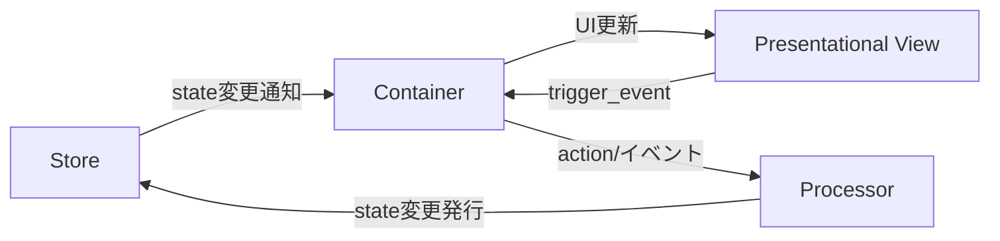

# PubSubTk ライブラリ - リファレンスガイド(ショート版)

## 目次

- [PubSubTk ライブラリ - リファレンスガイド(ショート版)](#pubsubtk-ライブラリ---リファレンスガイドショート版)
  - [目次](#目次)
  - [概要](#概要)
  - [主な特徴](#主な特徴)
  - [アーキテクチャ概要](#アーキテクチャ概要)
    - [構造イメージ](#構造イメージ)
    - [各コンポーネントの役割](#各コンポーネントの役割)
  - [🎯 推奨インポートパターン](#-推奨インポートパターン)
  - [主要メソッド一覧](#主要メソッド一覧)
  - [開発のポイント](#開発のポイント)
    - [StateProxyによるIDE連携](#stateproxyによるide連携)
    - [コンポーネント設計指針](#コンポーネント設計指針)
    - [カスタムトピック・PubSub拡張](#カスタムトピックpubsub拡張)
    - [よくある問題と解決法](#よくある問題と解決法)
  - [実践例](#実践例)
    - [全機能を活用したシンプルなカウンターアプリ](#全機能を活用したシンプルなカウンターアプリ)

## 概要

PubSubTk は、Pydantic を用いた型安全な状態管理と、Publish-Subscribe パターンを組み合わせて、Tkinter/ttk を使った GUI アプリケーションをシンプルに構築できる Python ライブラリです。

## 主な特徴

- **UIとビジネスロジックの疎結合** ― Publish/Subscribe（Pub/Sub）で部品間を非同期メッセージ連携
- **Pydanticモデル** による型安全な状態管理。バリデーションや JSON Schema 出力も簡単
- **Container / Presentational / Processor** 3層分離パターンを標準化（Reactスタイルの設計をTkinterでも）
- **Pub/Subによる画面遷移・サブウィンドウ管理**と**リアクティブUI更新**をサポート
- 依存は純正Pythonのみ（`tkinter`, `pypubsub`, `pydantic`）。Tkテーマ変更用に `ttkthemes` も利用可能

---

## アーキテクチャ概要

### 構造イメージ



### 各コンポーネントの役割

- **Store**: Pydanticモデルでアプリの状態を一元管理。型安全なアクセス＆更新通知が得られます。
- **Container**: 状態を購読し、UIと連動。ユーザー操作から Processor への橋渡しも担う。
- **Presentational**: 受け取ったデータを表示するだけの純粋View。状態管理・ロジックは一切持たない。
- **Processor**: ビジネスロジック/状態変更を集中管理。PubSub経由でContainer/Storeと通信。

---

## 🎯 推奨インポートパターン

```python
from pubsubtk import (
    TkApplication, ThemedApplication,           # アプリケーション
    ContainerComponentTk, ContainerComponentTtk, # コンテナ
    PresentationalComponentTk, PresentationalComponentTtk, # プレゼンテーション
    ProcessorBase,                              # プロセッサ
)
from pydantic import BaseModel
from typing import List, Optional, Dict, Any
import tkinter as tk
from tkinter import ttk
```

---

## 主要メソッド一覧

| メソッド                                      | 説明・用途                                 | 主な利用層                 |
| ----------------------------------------- | ------------------------------------- | --------------------- |
| `pub_switch_container(cls, kwargs)`       | メイン画面（Container）を切り替える                | Container / Processor |
| `pub_switch_slot(slot_name, cls, kwargs)` | テンプレート内の任意スロットのコンポーネントを切り替え           | Container / Processor |
| `pub_open_subwindow(cls, win_id, kwargs)` | サブウィンドウを開く                            | Container / Processor |
| `pub_close_subwindow(win_id)`             | 指定 ID のサブウィンドウを閉じる                    | Container / Processor |
| `pub_close_all_subwindows()`              | サブウィンドウをすべて閉じる                        | Container / Processor |
| `pub_replace_state(new_state)`            | 状態オブジェクト全体を置き換える                      | Processor / Container |
| `pub_update_state(state_path, new_value)` | 任意パスの状態を型安全に更新                        | Processor / Container |
| `pub_add_to_list(state_path, item)`       | リスト要素を型安全に追加                          | Processor / Container |
| `pub_add_to_dict(state_path, key, value)` | 辞書要素を型安全に追加                           | Processor / Container |
| `pub_register_processor(proc, name)`      | Processor を動的に登録                      | Processor             |
| `pub_delete_processor(name)`              | Processor を削除                         | Processor             |
| `sub_state_changed(state_path, handler)`  | 指定パスの値変更を購読（old_value, new_value受信）   | Container             |
| `sub_for_refresh(state_path, handler)`    | 状態更新時のUI再描画用シンプル通知を購読（引数なし）         | Container             |
| `sub_state_added(state_path, handler)`    | リストへの要素追加を購読（item, index受信）         | Container             |
| `sub_dict_item_added(state_path, handler)` | 辞書への要素追加を購読（key, value受信）            | Container             |
| `register_handler(event, cb)`             | PresentationalコンポーネントでViewイベントのハンドラ登録 | Container             |
| `trigger_event(event, **kwargs)`          | View→Containerへ任意イベント送出               | Presentational        |

---

## 開発のポイント

### StateProxyによるIDE連携

PubSubTkの最大の価値は、StateProxyによる強力なIDE連携です。

```python
# VSCode/PyCharmで以下が全て効く：
self.store.state.user.name
#            ↑     ↑
#    Ctrl+Click   Ctrl+Click
#    で定義へ     で定義へ

# ✅ F12: 定義へ移動
# ✅ Shift+F12: すべての参照を検索  
# ✅ F2: 安全なリネーム
# ✅ Ctrl+Space: 自動補完
```

**str()が必要なタイミング：**

```python
# ✅ 基本的な使用（str()不要）
self.pub_update_state(self.store.state.counter, 42)
self.sub_state_changed(self.store.state.todos, self.on_todos_changed)

# ✅ 文字列操作が必要な場合のみstr()を使用
path = str(self.store.state.user.name) + "_backup"
self.pub_update_state(f"todos.{index}", updated_todo)
```

### コンポーネント設計指針

**Container** - 状態に依存する処理、ユーザー操作のハンドリング

```python
class TodoContainer(ContainerComponentTk[AppState]):
    def setup_subscriptions(self):
        self.sub_state_changed(self.store.state.todos, self.on_todos_changed)

    def add_todo(self):
        # 状態更新
        self.pub_add_to_list(self.store.state.todos, new_todo)
```

**備考:** コンポーネントの ``__init__`` では与えられた ``*args`` と ``**kwargs`` が
``self.args`` / ``self.kwargs`` として保持されます。サブウィンドウを ``open_subwindow``
で開く場合は ``win_id`` が ``self.kwargs`` に自動追加され、
``pub_close_subwindow(self.kwargs["win_id"])`` で自身を閉じられます。今後も同様の
デフォルト引数が追加される可能性があります。

**Presentational** - 純粋な表示、再利用可能な部品

```python
class TodoItemView(PresentationalComponentTk):
    def update_data(self, todo_item: TodoItem):
        self.label.config(text=todo_item.text)
    
    def on_click(self):
        # Container側にイベント通知
        self.trigger_event("toggle", todo_id=self.todo_item.id)
```

**Template** - レイアウト構造の定義、スロットベースの画面構成

```python
class AppTemplate(TemplateComponentTk[AppState]):
    def define_slots(self):
        # 各領域を定義・配置
        self.header = tk.Frame(self, height=60)
        self.header.pack(fill=tk.X)
        
        self.main = tk.Frame(self)
        self.main.pack(fill=tk.BOTH, expand=True)
        
        self.sidebar = tk.Frame(self, width=200)
        self.sidebar.pack(side=tk.RIGHT, fill=tk.Y)
        
        return {
            "header": self.header,
            "main": self.main,
            "sidebar": self.sidebar
        }

# 使用例
app.set_template(AppTemplate)
app.pub_switch_slot("header", HeaderView)
app.pub_switch_slot("sidebar", NavigationPanel)
```

**Processor** - ビジネスロジック、複雑な状態操作

```python
class TodoProcessor(ProcessorBase[AppState]):
    def setup_subscriptions(self):
        self.subscribe("todo.bulk_update", self.handle_bulk_update)
    
    def handle_bulk_update(self, todo_ids: List[int]):
        # 複雑なロジック処理
        pass
```

### カスタムトピック・PubSub拡張

**AutoNamedTopicによるカスタムトピック作成**:

```python
from pubsubtk import AutoNamedTopic
from enum import auto

class MyAppTopic(AutoNamedTopic):
    USER_LOGIN = auto()        # -> "MyAppTopic.user_login"
    DATA_LOADED = auto()       # -> "MyAppTopic.data_loaded"
    ERROR_OCCURRED = auto()    # -> "MyAppTopic.error_occurred"
    FILE_EXPORT = auto()       # -> "MyAppTopic.file_export"

# 使用例
class MyProcessor(ProcessorBase[AppState]):
    def setup_subscriptions(self):
        self.subscribe(MyAppTopic.USER_LOGIN, self.handle_user_login)
        self.subscribe(MyAppTopic.DATA_LOADED, self.handle_data_loaded)
    
    def some_action(self):
        # カスタムトピックでメッセージ送信
        self.publish(MyAppTopic.FILE_EXPORT, format="csv", filename="data.csv")
```

**デフォルトトピック vs カスタムトピックの使い分け**:

```python
# ✅ デフォルト便利メソッドを使用（推奨）
self.pub_update_state(self.store.state.count, 42)      # 状態更新
self.pub_switch_container(NewContainer)                # 画面切り替え
self.pub_open_subwindow(DialogContainer)               # サブウィンドウ

# ✅ カスタムトピックを使用（ビジネスロジック特有の通信）
self.publish(MyAppTopic.USER_LOGIN, user_id=123)       # アプリ固有のイベント
self.subscribe(MyAppTopic.DATA_LOADED, self.on_data)   # 複雑なワークフロー
```

### よくある問題と解決法

**StateProxy使用時のエラー**:

```python
# ❌ エラーになる例
path = self.store.state.user.name.replace("old", "new")  # AttributeError

# ✅ 正しい使い方
path = str(self.store.state.user.name).replace("old", "new")
```

**便利メソッドの活用**:

```python
# ✅ 推奨: 組み込みメソッドを使用
self.pub_update_state(self.store.state.count, 42)
self.pub_switch_container(OtherContainer)

# ❌ 非推奨: 手動でトピック操作
self.publish(DefaultUpdateTopic.UPDATE_STATE, state_path="count", new_value=42)
```

---

## 実践例

### 全機能を活用したシンプルなカウンターアプリ

```python
"""
PubSubTk 全機能コンパクトデモ

PubSubDefaultTopicBaseの全メソッドを使用した小規模なデモアプリケーション
"""

import asyncio
import json
import tkinter as tk
from enum import auto
from tkinter import filedialog, messagebox, simpledialog
from typing import List

from pydantic import BaseModel

from pubsubtk import (
    AutoNamedTopic,
    ContainerComponentTk,
    PresentationalComponentTk,
    ProcessorBase,
    TemplateComponentTk,
    TkApplication,
    make_async_task,
)


# カスタムトピック
class AppTopic(AutoNamedTopic):
    INCREMENT = auto()
    RESET = auto()
    MILESTONE = auto()


# データモデル
class TodoItem(BaseModel):
    id: int
    text: str
    completed: bool = False


class AppState(BaseModel):
    counter: int = 0
    total_clicks: int = 0
    todos: List[TodoItem] = []
    next_todo_id: int = 1
    settings: dict = {"theme": "default", "auto_save": "true"}
    current_view: str = "main"


# =============================================================================
# テンプレート（3スロット構成）
# =============================================================================


class AppTemplate(TemplateComponentTk[AppState]):
    def define_slots(self):
        # ナビゲーション
        self.navbar = tk.Frame(self, height=40, bg="navy")
        self.navbar.pack(fill=tk.X)
        self.navbar.pack_propagate(False)

        # メインコンテンツ
        self.main_area = tk.Frame(self)
        self.main_area.pack(fill=tk.BOTH, expand=True, side=tk.LEFT)

        # サイドバー
        self.sidebar = tk.Frame(self, width=200, bg="lightgray")
        self.sidebar.pack(fill=tk.Y, side=tk.RIGHT)
        self.sidebar.pack_propagate(False)

        return {
            "navbar": self.navbar,
            "main": self.main_area,
            "sidebar": self.sidebar,
        }


# =============================================================================
# Presentationalコンポーネント（純粋表示）
# =============================================================================


class TodoItemView(PresentationalComponentTk):
    def setup_ui(self):
        self.configure(relief=tk.RAISED, borderwidth=1, padx=5, pady=3)

        self.var = tk.BooleanVar()
        self.checkbox = tk.Checkbutton(self, variable=self.var, command=self.on_toggle)
        self.checkbox.pack(side=tk.LEFT)

        self.label = tk.Label(self, text="", anchor="w")
        self.label.pack(side=tk.LEFT, fill=tk.X, expand=True)

        self.delete_btn = tk.Button(self, text="×", width=3, command=self.on_delete)
        self.delete_btn.pack(side=tk.RIGHT)

    def update_data(self, todo: TodoItem):
        self.todo = todo
        self.var.set(todo.completed)
        text = f"✓ {todo.text}" if todo.completed else todo.text
        self.label.config(text=text, fg="gray" if todo.completed else "black")

    def on_toggle(self):
        self.trigger_event("toggle", todo_id=self.todo.id)

    def on_delete(self):
        self.trigger_event("delete", todo_id=self.todo.id)


class StatsView(PresentationalComponentTk):
    def setup_ui(self):
        self.configure(bg="lightblue", relief=tk.SUNKEN, borderwidth=2)

        tk.Label(self, text="📊 統計", font=("Arial", 12, "bold"), bg="lightblue").pack(
            pady=5
        )

        self.stats_label = tk.Label(self, text="", bg="lightblue", justify=tk.LEFT)
        self.stats_label.pack(padx=10, pady=5, fill=tk.BOTH, expand=True)

    def update_stats(
        self,
        counter: int,
        total_clicks: int,
        total_todos: int,
        completed_todos: int,
        settings_count: int,
        current_view: str,
    ):
        """純粋な表示コンポーネント - 必要なデータのみを個別に受け取る"""
        uncompleted = total_todos - completed_todos

        stats = f"""
        カウンター: {counter}
        総クリック: {total_clicks}

        Todo統計:
        ・総数: {total_todos}
        ・完了: {completed_todos}
        ・未完了: {uncompleted}

        設定数: {settings_count}
        現在画面: {current_view}
        """

        self.stats_label.config(text=stats)


# =============================================================================
# Containerコンポーネント（状態連携）
# =============================================================================


class NavbarContainer(ContainerComponentTk[AppState]):
    def setup_ui(self):
        self.configure(bg="navy")

        tk.Label(
            self,
            text="🎯 PubSubTk Demo",
            fg="white",
            bg="navy",
            font=("Arial", 14, "bold"),
        ).pack(side=tk.LEFT, padx=10, pady=5)

        nav_frame = tk.Frame(self, bg="navy")
        nav_frame.pack(side=tk.RIGHT, padx=10)

        self.main_btn = tk.Button(nav_frame, text="メイン", command=self.switch_to_main)
        self.main_btn.pack(side=tk.LEFT, padx=2)

        self.todo_btn = tk.Button(nav_frame, text="Todo", command=self.switch_to_todo)
        self.todo_btn.pack(side=tk.LEFT, padx=2)

    def setup_subscriptions(self):
        self.sub_state_changed(self.store.state.current_view, self.on_view_changed)

    def refresh_from_state(self):
        state = self.store.get_current_state()
        self.update_buttons(state.current_view)

    def on_view_changed(self, old_value, new_value):
        self.update_buttons(new_value)

    def update_buttons(self, current_view: str):
        self.main_btn.config(
            bg="lightblue" if current_view == "main" else "SystemButtonFace"
        )
        self.todo_btn.config(
            bg="lightblue" if current_view == "todo" else "SystemButtonFace"
        )

    def switch_to_main(self):
        self.pub_update_state(self.store.state.current_view, "main")
        self.pub_switch_slot("main", MainContainer)

    def switch_to_todo(self):
        self.pub_update_state(self.store.state.current_view, "todo")
        self.pub_switch_slot("main", TodoContainer)


class MainContainer(ContainerComponentTk[AppState]):
    def setup_ui(self):
        tk.Label(self, text="🏠 メインビュー", font=("Arial", 16, "bold")).pack(pady=10)

        # カウンター
        self.counter_label = tk.Label(self, text="0", font=("Arial", 32))
        self.counter_label.pack(pady=20)

        # ボタン群
        btn_frame = tk.Frame(self)
        btn_frame.pack(pady=10)

        tk.Button(btn_frame, text="カウント", command=self.increment).pack(
            side=tk.LEFT, padx=5
        )
        tk.Button(btn_frame, text="リセット", command=self.reset).pack(
            side=tk.LEFT, padx=5
        )
        tk.Button(btn_frame, text="サブウィンドウ", command=self.open_sub).pack(
            side=tk.LEFT, padx=5
        )

        # ファイル操作
        file_frame = tk.Frame(self)
        file_frame.pack(pady=10)

        tk.Button(file_frame, text="保存", command=self.save_data).pack(
            side=tk.LEFT, padx=5
        )
        tk.Button(file_frame, text="読込", command=self.load_data).pack(
            side=tk.LEFT, padx=5
        )

        # 設定操作（辞書機能テスト）
        setting_frame = tk.Frame(self)
        setting_frame.pack(pady=10)

        tk.Button(setting_frame, text="設定追加", command=self.add_setting).pack(
            side=tk.LEFT, padx=5
        )
        tk.Button(
            setting_frame, text="プロセッサー追加", command=self.add_processor
        ).pack(side=tk.LEFT, padx=5)

        # 危険な操作
        tk.Button(
            self, text="全状態リセット", command=self.reset_all, bg="red", fg="white"
        ).pack(pady=10)

    def setup_subscriptions(self):
        self.sub_state_changed(self.store.state.counter, self.on_counter_changed)
        self.subscribe(AppTopic.MILESTONE, self.on_milestone)

    def refresh_from_state(self):
        state = self.store.get_current_state()
        self.counter_label.config(text=str(state.counter))

    def on_counter_changed(self, old_value, new_value):
        self.counter_label.config(text=str(new_value))

    def increment(self):
        self.publish(AppTopic.INCREMENT)

    def reset(self):
        self.publish(AppTopic.RESET)

    def open_sub(self):
        self.pub_open_subwindow(SubWindow)

    @make_async_task
    async def save_data(self):
        filename = filedialog.asksaveasfilename(defaultextension=".json")
        if filename:
            await asyncio.sleep(0.3)  # 保存処理シミュレート
            state = self.store.get_current_state()
            with open(filename, "w") as f:
                json.dump(state.model_dump(), f, indent=2)
            messagebox.showinfo("完了", "データを保存しました")

    @make_async_task
    async def load_data(self):
        filename = filedialog.askopenfilename(filetypes=[("JSON files", "*.json")])
        if filename:
            await asyncio.sleep(0.3)  # 読込処理シミュレート
            with open(filename, "r") as f:
                data = json.load(f)
            new_state = AppState.model_validate(data)
            self.pub_replace_state(new_state)
            # 状態リセット後は画面も適切に切り替える
            self.pub_switch_slot("main", MainContainer)
            messagebox.showinfo("完了", "データを読み込みました")

    def add_setting(self):
        key = simpledialog.askstring("設定追加", "キーを入力:")
        if key:
            value = simpledialog.askstring("設定追加", "値を入力:")
            if value:
                # pub_add_to_dict使用
                self.pub_add_to_dict(self.store.state.settings, key, value)

    @make_async_task
    async def add_processor(self):
        await asyncio.sleep(0.5)  # プロセッサー初期化シミュレート
        try:
            # pub_register_processor使用
            self.pub_register_processor(DummyProcessor, "dummy")
            messagebox.showinfo("成功", "プロセッサーを追加しました")
        except Exception as e:
            messagebox.showerror("エラー", str(e))

    @make_async_task
    async def reset_all(self):
        if messagebox.askyesno("確認", "全状態をリセットしますか？"):
            await asyncio.sleep(1.0)  # 重い処理シミュレート
            # pub_replace_state使用
            self.pub_replace_state(AppState())
            # リセット後はメイン画面に戻る
            self.pub_switch_slot("main", MainContainer)
            messagebox.showinfo("完了", "状態をリセットしました")

    def on_milestone(self, value: int):
        messagebox.showinfo("マイルストーン!", f"{value}に到達！")


class TodoContainer(ContainerComponentTk[AppState]):
    def setup_ui(self):
        tk.Label(self, text="📝 Todo管理", font=("Arial", 16, "bold")).pack(pady=10)

        # Todo追加
        add_frame = tk.Frame(self)
        add_frame.pack(fill=tk.X, padx=10, pady=5)

        self.entry = tk.Entry(add_frame)
        self.entry.pack(side=tk.LEFT, fill=tk.X, expand=True, padx=5)
        self.entry.bind("<Return>", lambda e: self.add_todo())

        tk.Button(add_frame, text="追加", command=self.add_todo).pack(side=tk.RIGHT)

        # Todoリスト
        list_frame = tk.Frame(self, relief=tk.SUNKEN, borderwidth=2)
        list_frame.pack(fill=tk.BOTH, expand=True, padx=10, pady=10)

        # スクロール可能フレーム
        canvas = tk.Canvas(list_frame)
        scrollbar = tk.Scrollbar(list_frame, orient="vertical", command=canvas.yview)
        self.scrollable_frame = tk.Frame(canvas)

        self.scrollable_frame.bind(
            "<Configure>", lambda e: canvas.configure(scrollregion=canvas.bbox("all"))
        )

        canvas.create_window((0, 0), window=self.scrollable_frame, anchor="nw")
        canvas.configure(yscrollcommand=scrollbar.set)

        canvas.pack(side="left", fill="both", expand=True)
        scrollbar.pack(side="right", fill="y")

        self.todo_widgets = {}

    def setup_subscriptions(self):
        # sub_state_addedとsub_for_refresh使用
        self.sub_state_added(self.store.state.todos, self.on_todo_added)
        self.sub_for_refresh(self.store.state.todos, self.refresh_todo_list)

    def refresh_from_state(self):
        self.refresh_todo_list()

    def refresh_todo_list(self):
        # 既存ウィジェットクリア
        for widget in self.todo_widgets.values():
            widget.destroy()
        self.todo_widgets.clear()

        # 新しいリストを描画
        state = self.store.get_current_state()
        for todo in state.todos:
            todo_widget = TodoItemView(self.scrollable_frame)
            todo_widget.pack(fill=tk.X, padx=5, pady=2)
            todo_widget.update_data(todo)

            # イベントハンドラ登録
            todo_widget.register_handler("toggle", self.toggle_todo)
            todo_widget.register_handler("delete", self.delete_todo)

            self.todo_widgets[todo.id] = todo_widget

    def on_todo_added(self, item: TodoItem, index: int):
        # 新規追加時は全体再描画
        self.refresh_todo_list()

    def add_todo(self):
        text = self.entry.get().strip()
        if not text:
            return

        state = self.store.get_current_state()
        new_todo = TodoItem(id=state.next_todo_id, text=text)

        # pub_add_to_list使用
        self.pub_add_to_list(self.store.state.todos, new_todo)
        self.pub_update_state(self.store.state.next_todo_id, state.next_todo_id + 1)

        self.entry.delete(0, tk.END)

    def toggle_todo(self, todo_id: int):
        state = self.store.get_current_state()
        updated_todos = []
        for todo in state.todos:
            if todo.id == todo_id:
                updated = todo.model_copy()
                updated.completed = not updated.completed
                updated_todos.append(updated)
            else:
                updated_todos.append(todo)

        self.pub_update_state(self.store.state.todos, updated_todos)

    @make_async_task
    async def delete_todo(self, todo_id: int):
        if messagebox.askyesno("確認", "このTodoを削除しますか？"):
            await asyncio.sleep(0.2)  # 削除処理シミュレート
            state = self.store.get_current_state()
            updated_todos = [t for t in state.todos if t.id != todo_id]
            self.pub_update_state(self.store.state.todos, updated_todos)


class SidebarContainer(ContainerComponentTk[AppState]):
    def setup_ui(self):
        self.configure(bg="lightgray")

        # 統計表示（Presentationalコンポーネント使用）
        self.stats_view = StatsView(self)
        self.stats_view.pack(fill=tk.BOTH, expand=True, padx=5, pady=5)

        # 操作ボタン
        btn_frame = tk.Frame(self, bg="lightgray")
        btn_frame.pack(fill=tk.X, padx=5, pady=5)

        tk.Button(btn_frame, text="全ウィンドウ閉じる", command=self.close_all).pack(
            fill=tk.X, pady=2
        )
        tk.Button(btn_frame, text="プロセッサー削除", command=self.delete_proc).pack(
            fill=tk.X, pady=2
        )

    def setup_subscriptions(self):
        # 複数の状態変更を監視
        self.sub_for_refresh(self.store.state.counter, self.refresh_from_state)
        self.sub_for_refresh(self.store.state.todos, self.refresh_from_state)
        self.sub_for_refresh(self.store.state.settings, self.refresh_from_state)
        self.sub_for_refresh(self.store.state.total_clicks, self.refresh_from_state)
        self.sub_for_refresh(self.store.state.current_view, self.refresh_from_state)
        # sub_dict_item_added使用
        self.sub_dict_item_added(self.store.state.settings, self.on_setting_added)

    def refresh_from_state(self):
        state = self.store.get_current_state()
        # Containerで状態から必要な値を抽出してPresentationalに渡す
        completed_todos = sum(1 for t in state.todos if t.completed)
        total_todos = len(state.todos)

        self.stats_view.update_stats(
            counter=state.counter,
            total_clicks=state.total_clicks,
            total_todos=total_todos,
            completed_todos=completed_todos,
            settings_count=len(state.settings),
            current_view=state.current_view,
        )

    def on_setting_added(self, key: str, value: str):
        messagebox.showinfo("設定追加", f"設定追加: {key} = {value}")

    def close_all(self):
        # pub_close_all_subwindows使用
        self.pub_close_all_subwindows()

    def delete_proc(self):
        try:
            # pub_delete_processor使用
            self.pub_delete_processor("dummy")
            messagebox.showinfo("成功", "プロセッサーを削除しました")
        except KeyError:
            messagebox.showerror("エラー", "プロセッサーが見つかりません")


# =============================================================================
# サブウィンドウ
# =============================================================================


class SubWindow(ContainerComponentTk[AppState]):
    def setup_ui(self):
        tk.Label(self, text="🔢 サブウィンドウ", font=("Arial", 14)).pack(pady=10)

        self.value_label = tk.Label(self, text="0", font=("Arial", 20))
        self.value_label.pack(pady=10)

        btn_frame = tk.Frame(self)
        btn_frame.pack(pady=10)

        tk.Button(btn_frame, text="+1", command=self.increment).pack(
            side=tk.LEFT, padx=5
        )
        tk.Button(btn_frame, text="+5", command=lambda: self.add_value(5)).pack(
            side=tk.LEFT, padx=5
        )

        tk.Button(self, text="閉じる", command=self.close_window).pack(pady=10)

    def setup_subscriptions(self):
        self.sub_state_changed(self.store.state.counter, self.on_counter_changed)

    def refresh_from_state(self):
        state = self.store.get_current_state()
        self.value_label.config(text=str(state.counter))

    def on_counter_changed(self, old_value, new_value):
        self.value_label.config(text=str(new_value))

    def increment(self):
        self.publish(AppTopic.INCREMENT)

    def add_value(self, value: int):
        state = self.store.get_current_state()
        new_value = state.counter + value
        self.pub_update_state(self.store.state.counter, new_value)
        self.pub_update_state(self.store.state.total_clicks, state.total_clicks + 1)

    def close_window(self):
        # pub_close_subwindow使用
        self.pub_close_subwindow(self.kwargs["win_id"])


# =============================================================================
# プロセッサー
# =============================================================================


class MainProcessor(ProcessorBase[AppState]):
    def setup_subscriptions(self):
        self.subscribe(AppTopic.INCREMENT, self.handle_increment)
        self.subscribe(AppTopic.RESET, self.handle_reset)

    def handle_increment(self):
        state = self.store.get_current_state()
        new_counter = state.counter + 1
        new_total = state.total_clicks + 1

        self.pub_update_state(self.store.state.counter, new_counter)
        self.pub_update_state(self.store.state.total_clicks, new_total)

        # マイルストーン判定
        if new_counter % 10 == 0:
            self.publish(AppTopic.MILESTONE, value=new_counter)

    def handle_reset(self):
        self.pub_update_state(self.store.state.counter, 0)


class DummyProcessor(ProcessorBase[AppState]):
    def setup_subscriptions(self):
        print("DummyProcessor: 初期化されました")


# =============================================================================
# メインアプリケーション
# =============================================================================

if __name__ == "__main__":
    app = TkApplication(AppState, title="🎯 PubSubTk Demo", geometry="800x600")

    # メインプロセッサー登録
    app.pub_register_processor(MainProcessor)

    # テンプレート設定
    app.set_template(AppTemplate)

    # 各スロットにコンテナ配置
    app.pub_switch_slot("navbar", NavbarContainer)
    app.pub_switch_slot("main", MainContainer)  # 初期画面
    app.pub_switch_slot("sidebar", SidebarContainer)

    # 起動
    app.run(use_async=True)

```
