# PubSubTk ライブラリ - リファレンスガイド(ショート版)

## 目次

- [PubSubTk ライブラリ - リファレンスガイド(ショート版)](#pubsubtk-ライブラリ---リファレンスガイドショート版)
  - [目次](#目次)
  - [概要](#概要)
  - [主な特徴](#主な特徴)
  - [アーキテクチャ概要](#アーキテクチャ概要)
    - [構造イメージ](#構造イメージ)
    - [各コンポーネントの役割](#各コンポーネントの役割)
  - [🎯 推奨インポートパターン](#-推奨インポートパターン)
  - [主要メソッド一覧](#主要メソッド一覧)
  - [開発のポイント](#開発のポイント)
    - [StateProxyによるIDE連携](#stateproxyによるide連携)
    - [コンポーネント設計指針](#コンポーネント設計指針)
    - [カスタムトピック・PubSub拡張](#カスタムトピックpubsub拡張)
    - [よくある問題と解決法](#よくある問題と解決法)
  - [実践例](#実践例)
    - [全機能を活用したシンプルなカウンターアプリ](#全機能を活用したシンプルなカウンターアプリ)

## 概要

PubSubTk は、Pydantic を用いた型安全な状態管理と、Publish-Subscribe パターンを組み合わせて、Tkinter/ttk を使った GUI アプリケーションをシンプルに構築できる Python ライブラリです。

## 主な特徴

- **UIとビジネスロジックの疎結合** ― Publish/Subscribe（Pub/Sub）で部品間を非同期メッセージ連携
- **Pydanticモデル** による型安全な状態管理。バリデーションや JSON Schema 出力も簡単
- **Container / Presentational / Processor** 3層分離パターンを標準化（Reactスタイルの設計をTkinterでも）
- **Pub/Subによる画面遷移・サブウィンドウ管理**と**リアクティブUI更新**をサポート
- 依存は純正Pythonのみ（`tkinter`, `pypubsub`, `pydantic`）。Tkテーマ変更用に `ttkthemes` も利用可能

---

## アーキテクチャ概要

### 構造イメージ

```mermaid
graph LR
  Store[Store]
  Processor[Processor]
  Container[Container]
  View[Presentational View]
  
  Processor -- state変更発行 --> Store
  Store -- state変更通知 --> Container
  Container -- UI更新 --> View
  View -- trigger_event --> Container
  Container -- action/イベント --> Processor
```



### 各コンポーネントの役割

- **Store**: Pydanticモデルでアプリの状態を一元管理。型安全なアクセス＆更新通知が得られます。
- **Container**: 状態を購読し、UIと連動。ユーザー操作から Processor への橋渡しも担う。
- **Presentational**: 受け取ったデータを表示するだけの純粋View。状態管理・ロジックは一切持たない。
- **Processor**: ビジネスロジック/状態変更を集中管理。PubSub経由でContainer/Storeと通信。

---

## 🎯 推奨インポートパターン

```python
from pubsubtk import (
    TkApplication, ThemedApplication,           # アプリケーション
    ContainerComponentTk, ContainerComponentTtk, # コンテナ
    PresentationalComponentTk, PresentationalComponentTtk, # プレゼンテーション
    ProcessorBase,                              # プロセッサ
)
from pydantic import BaseModel
from typing import List, Optional, Dict, Any
import tkinter as tk
from tkinter import ttk
```

---

## 主要メソッド一覧

| メソッド                                      | 説明・用途                                 | 主な利用層                 |
| ----------------------------------------- | ------------------------------------- | --------------------- |
| `pub_switch_container(cls, kwargs)`       | メイン画面（Container）を切り替える                | Container / Processor |
| `pub_switch_slot(slot, cls, kwargs)`      | テンプレート内の任意スロットのコンポーネントを切り替え           | Container / Processor |
| `pub_open_subwindow(cls, win_id, kwargs)` | サブウィンドウを開く                            | Container / Processor |
| `pub_close_subwindow(win_id)`             | 指定 ID のサブウィンドウを閉じる                    | Container / Processor |
| `pub_close_all_subwindows()`              | サブウィンドウをすべて閉じる                        | Container / Processor |
| `pub_update_state(path, value)`           | 任意パスの状態を型安全に更新                        | Processor / Container |
| `pub_add_to_list(path, item)`             | リスト要素を型安全に追加                          | Processor / Container |
| `pub_registor_processor(cls, name)`       | Processor を動的に登録                      | Processor             |
| `pub_delete_processor(name)`              | Processor を削除                         | Processor             |
| `sub_state_changed(path, handler)`        | 指定パスの値変更を購読                           | Container             |
| `sub_state_added(path, handler)`          | リストへの要素追加を購読                          | Container             |
| `register_handler(event, cb)`             | PresentationalコンポーネントでViewイベントのハンドラ登録 | Container             |
| `trigger_event(event, **kwargs)`          | View→Containerへ任意イベント送出               | Presentational        |

---

## 開発のポイント

### StateProxyによるIDE連携

PubSubTkの最大の価値は、StateProxyによる強力なIDE連携です。

```python
# VSCode/PyCharmで以下が全て効く：
self.store.state.user.name
#            ↑     ↑
#    Ctrl+Click   Ctrl+Click
#    で定義へ     で定義へ

# ✅ F12: 定義へ移動
# ✅ Shift+F12: すべての参照を検索  
# ✅ F2: 安全なリネーム
# ✅ Ctrl+Space: 自動補完
```

**str()が必要なタイミング：**

```python
# ✅ 基本的な使用（str()不要）
self.pub_update_state(self.store.state.counter, 42)
self.sub_state_changed(self.store.state.todos, self.on_todos_changed)

# ✅ 文字列操作が必要な場合のみstr()を使用
path = str(self.store.state.user.name) + "_backup"
self.pub_update_state(f"todos.{index}", updated_todo)
```

### コンポーネント設計指針

**Container** - 状態に依存する処理、ユーザー操作のハンドリング

```python
class TodoContainer(ContainerComponentTk[AppState]):
    def setup_subscriptions(self):
        self.sub_state_changed(self.store.state.todos, self.on_todos_changed)
    
    def add_todo(self):
        # 状態更新
        self.pub_add_to_list(self.store.state.todos, new_todo)
```

**Presentational** - 純粋な表示、再利用可能な部品

```python
class TodoItemView(PresentationalComponentTk):
    def update_data(self, todo_item: TodoItem):
        self.label.config(text=todo_item.text)
    
    def on_click(self):
        # Container側にイベント通知
        self.trigger_event("toggle", todo_id=self.todo_item.id)
```

**Template** - レイアウト構造の定義、スロットベースの画面構成

```python
class AppTemplate(TemplateComponentTk[AppState]):
    def define_slots(self):
        # 各領域を定義・配置
        self.header = tk.Frame(self, height=60)
        self.header.pack(fill=tk.X)
        
        self.main = tk.Frame(self)
        self.main.pack(fill=tk.BOTH, expand=True)
        
        self.sidebar = tk.Frame(self, width=200)
        self.sidebar.pack(side=tk.RIGHT, fill=tk.Y)
        
        return {
            "header": self.header,
            "main": self.main,
            "sidebar": self.sidebar
        }

# 使用例
app.set_template(AppTemplate)
app.pub_switch_slot("header", HeaderView)
app.pub_switch_slot("sidebar", NavigationPanel)
```

**Processor** - ビジネスロジック、複雑な状態操作

```python
class TodoProcessor(ProcessorBase[AppState]):
    def setup_subscriptions(self):
        self.subscribe("todo.bulk_update", self.handle_bulk_update)
    
    def handle_bulk_update(self, todo_ids: List[int]):
        # 複雑なロジック処理
        pass
```

### カスタムトピック・PubSub拡張

**AutoNamedTopicによるカスタムトピック作成**:

```python
from pubsubtk.topic.topics import AutoNamedTopic
from enum import auto

class MyAppTopic(AutoNamedTopic):
    USER_LOGIN = auto()        # -> "MyAppTopic.user_login"
    DATA_LOADED = auto()       # -> "MyAppTopic.data_loaded"
    ERROR_OCCURRED = auto()    # -> "MyAppTopic.error_occurred"
    FILE_EXPORT = auto()       # -> "MyAppTopic.file_export"

# 使用例
class MyProcessor(ProcessorBase[AppState]):
    def setup_subscriptions(self):
        self.subscribe(MyAppTopic.USER_LOGIN, self.handle_user_login)
        self.subscribe(MyAppTopic.DATA_LOADED, self.handle_data_loaded)
    
    def some_action(self):
        # カスタムトピックでメッセージ送信
        self.publish(MyAppTopic.FILE_EXPORT, format="csv", filename="data.csv")
```

**デフォルトトピック vs カスタムトピックの使い分け**:

```python
# ✅ デフォルト便利メソッドを使用（推奨）
self.pub_update_state(self.store.state.count, 42)      # 状態更新
self.pub_switch_container(NewContainer)                # 画面切り替え
self.pub_open_subwindow(DialogContainer)               # サブウィンドウ

# ✅ カスタムトピックを使用（ビジネスロジック特有の通信）
self.publish(MyAppTopic.USER_LOGIN, user_id=123)       # アプリ固有のイベント
self.subscribe(MyAppTopic.DATA_LOADED, self.on_data)   # 複雑なワークフロー
```

### よくある問題と解決法

**StateProxy使用時のエラー**:

```python
# ❌ エラーになる例
path = self.store.state.user.name.replace("old", "new")  # AttributeError

# ✅ 正しい使い方
path = str(self.store.state.user.name).replace("old", "new")
```

**便利メソッドの活用**:

```python
# ✅ 推奨: 組み込みメソッドを使用
self.pub_update_state(self.store.state.count, 42)
self.pub_switch_container(OtherContainer)

# ❌ 非推奨: 手動でトピック操作
self.publish(DefaultUpdateTopic.UPDATE_STATE, state_path="count", new_value=42)
```

---

## 実践例

### 全機能を活用したシンプルなカウンターアプリ

```python
import tkinter as tk
from enum import auto

from pydantic import BaseModel

from pubsubtk import (
    ContainerComponentTk,
    PresentationalComponentTk,
    ProcessorBase,
    TemplateComponentTk,
    TkApplication,
)
from pubsubtk.topic.topics import AutoNamedTopic


# カスタムトピック定義
class AppTopic(AutoNamedTopic):
    INCREMENT = auto()  # -> "AppTopic.increment"
    RESET = auto()  # -> "AppTopic.reset"
    MILESTONE = auto()  # -> "AppTopic.milestone"


class AppState(BaseModel):
    counter: int = 0
    total_clicks: int = 0


# テンプレート定義
class AppTemplate(TemplateComponentTk[AppState]):
    def define_slots(self):
        # ヘッダー
        self.header = tk.Frame(self, height=50, bg="lightblue")
        self.header.pack(fill=tk.X)

        # メインコンテンツ
        self.main = tk.Frame(self)
        self.main.pack(fill=tk.BOTH, expand=True)

        return {
            "header": self.header,
            "main": self.main,
        }


# Presentationalコンポーネント（ヘッダー表示）
class HeaderView(PresentationalComponentTk):
    def setup_ui(self):
        self.label = tk.Label(
            self, text="PubSubTk Demo", font=("Arial", 16), bg="lightblue"
        )
        self.label.pack(pady=10)

    def update_data(self, total_clicks: int):
        self.label.config(text=f"PubSubTk Demo - Total Clicks: {total_clicks}")


# Containerコンポーネント（ヘッダー管理）
class HeaderContainer(ContainerComponentTk[AppState]):
    def setup_ui(self):
        self.header_view = HeaderView(self)
        self.header_view.pack(fill=tk.BOTH, expand=True)

    def setup_subscriptions(self):
        self.sub_state_changed(self.store.state.total_clicks, self.update_header)

    def refresh_from_state(self):
        self.update_header(None, None)

    def update_header(self, old_value, new_value):
        state = self.store.get_current_state()
        self.header_view.update_data(state.total_clicks)


# Containerコンポーネント（メインカウンター）
class CounterContainer(ContainerComponentTk[AppState]):
    def setup_ui(self):
        # カウンター表示
        self.counter_label = tk.Label(self, text="0", font=("Arial", 32))
        self.counter_label.pack(pady=30)

        # ボタン
        btn_frame = tk.Frame(self)
        btn_frame.pack(pady=20)

        tk.Button(
            btn_frame, text="カウントアップ", command=self.increment, font=("Arial", 12)
        ).pack(side=tk.LEFT, padx=10)
        tk.Button(
            btn_frame, text="リセット", command=self.reset, font=("Arial", 12)
        ).pack(side=tk.LEFT, padx=10)

    def setup_subscriptions(self):
        self.sub_state_changed(self.store.state.counter, self.on_counter_changed)
        self.subscribe(AppTopic.MILESTONE, self.on_milestone)

    def refresh_from_state(self):
        state = self.store.get_current_state()
        self.counter_label.config(text=str(state.counter))

    def increment(self):
        # カスタムトピックでインクリメント通知
        self.publish(AppTopic.INCREMENT)

    def reset(self):
        # カスタムトピックでリセット通知
        self.publish(AppTopic.RESET)

    def on_counter_changed(self, old_value, new_value):
        self.counter_label.config(text=str(new_value))

    def on_milestone(self, value: int):
        tk.messagebox.showinfo("マイルストーン!", f"{value} に到達しました！")


# Processor（ビジネスロジック）
class CounterProcessor(ProcessorBase[AppState]):
    def setup_subscriptions(self):
        self.subscribe(AppTopic.INCREMENT, self.handle_increment)
        self.subscribe(AppTopic.RESET, self.handle_reset)

    def handle_increment(self):
        state = self.store.get_current_state()
        new_counter = state.counter + 1
        new_total = state.total_clicks + 1

        # StateProxyで型安全な状態更新
        self.pub_update_state(self.store.state.counter, new_counter)
        self.pub_update_state(self.store.state.total_clicks, new_total)

        # マイルストーン判定
        if new_counter % 10 == 0:
            self.publish(AppTopic.MILESTONE, value=new_counter)

    def handle_reset(self):
        # 便利メソッドで状態リセット
        self.pub_update_state(self.store.state.counter, 0)


if __name__ == "__main__":
    app = TkApplication(AppState, title="PubSubTk Simple Demo", geometry="400x300")
    # Processor登録
    app.pub_register_processor(CounterProcessor)

    # テンプレート設定
    app.set_template(AppTemplate)

    # 各スロットにコンポーネント配置
    app.pub_switch_slot("header", HeaderContainer)
    app.pub_switch_slot("main", CounterContainer)

    # 起動
    app.run()
```
