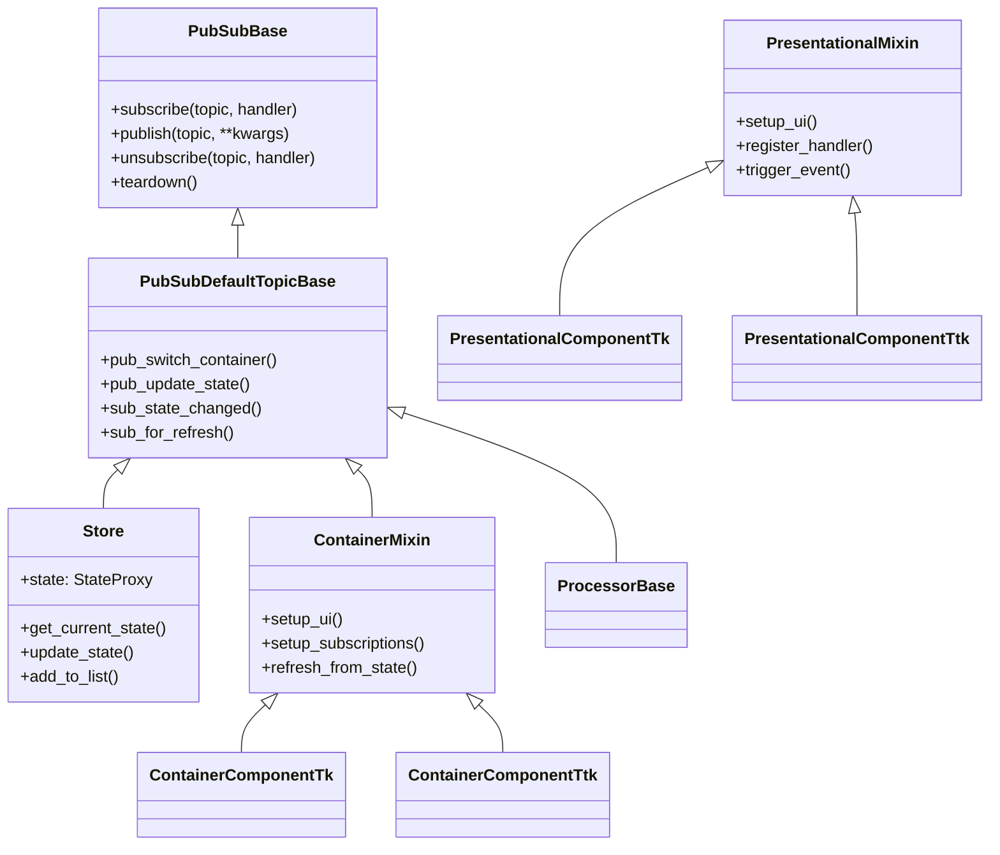

# API Reference

PubSubTkライブラリの詳細なAPIリファレンスです。

## 📚 モジュール構成

PubSubTkは以下のモジュールで構成されています：

### Core Modules

- **[pubsubtk.core](core/)** - PubSubパターンの基底クラス群
  - `PubSubBase` - PubSub機能の基底クラス
  - `PubSubDefaultTopicBase` - デフォルトトピック操作用便利メソッド

- **[pubsubtk.store](store/)** - 状態管理システム
  - `Store` - Pydanticベースの型安全な状態管理
  - `StateProxy` - IDE連携を強化するプロキシクラス

- **[pubsubtk.topic](topic/)** - トピック定義システム
  - `AutoNamedTopic` - 自動命名トピック列挙型
  - `DefaultNavigateTopic` - 画面遷移用標準トピック
  - `DefaultUpdateTopic` - 状態更新用標準トピック

### Application Framework

- **[pubsubtk.app](app/)** - アプリケーション基底クラス
  - `TkApplication` - 標準Tkアプリケーション
  - `ThemedApplication` - テーマ対応アプリケーション

- **[pubsubtk.processor](processor/)** - ビジネスロジック層
  - `ProcessorBase` - プロセッサー基底クラス

### UI Components

- **[pubsubtk.ui](ui/)** - UIコンポーネント群
  - `ContainerComponentTk/Ttk` - 状態連携UIコンテナ
  - `PresentationalComponentTk/Ttk` - 純粋表示コンポーネント
  - `TemplateComponentTk/Ttk` - マルチスロットテンプレート

### Utilities

- **[pubsubtk.utils](utils/)** - ユーティリティ関数
  - `make_async` - 非同期化デコレーター
  - `make_async_task` - タスク化デコレーター

## 🎯 主要クラス階層



## 🚀 クイックナビゲーション

### よく使用されるクラス

| クラス | 用途 | ドキュメント |
|--------|------|-------------|
| `TkApplication` | アプリケーション本体 | [app.TkApplication](app/#pubsubtk.app.TkApplication) |
| `ContainerComponentTk` | 状態連携UI | [ui.ContainerComponentTk](ui/#pubsubtk.ui.ContainerComponentTk) |
| `PresentationalComponentTk` | 純粋表示UI | [ui.PresentationalComponentTk](ui/#pubsubtk.ui.PresentationalComponentTk) |
| `ProcessorBase` | ビジネスロジック | [processor.ProcessorBase](processor/#pubsubtk.processor.ProcessorBase) |
| `Store` | 状態管理 | [store.Store](store/#pubsubtk.store.Store) |

### よく使用されるメソッド

| メソッド | 説明 | 利用場面 |
|----------|------|----------|
| `pub_update_state()` | 状態更新 | Container, Processor |
| `pub_switch_container()` | 画面切り替え | Container, Processor |
| `sub_state_changed()` | 状態変更監視 | Container |
| `setup_subscriptions()` | 購読設定 | Container, Processor |
| `refresh_from_state()` | UI更新 | Container |

## 📖 使用パターン

### 基本的な使用パターン

```python
# 1. 状態定義
class AppState(BaseModel):
    counter: int = 0

# 2. コンテナ作成
class MainContainer(ContainerComponentTk[AppState]):
    def setup_ui(self):
        # UI構築
        pass
    
    def setup_subscriptions(self):
        # 状態監視
        self.sub_state_changed(self.store.state.counter, self.on_counter_changed)
    
    def refresh_from_state(self):
        # UI更新
        pass

# 3. アプリケーション起動
app = TkApplication(AppState)
app.switch_container(MainContainer)
app.run()
```

### プロセッサーパターン

```python
class MyProcessor(ProcessorBase[AppState]):
    def setup_subscriptions(self):
        self.subscribe("custom.event", self.handle_event)
    
    def handle_event(self):
        # ビジネスロジック
        self.pub_update_state(self.store.state.counter, 42)

# アプリケーション起動時に登録
app.pub_register_processor(MyProcessor)
```

### テンプレートパターン

```python
class AppTemplate(TemplateComponentTk[AppState]):
    def define_slots(self):
        return {
            "header": self.header_frame,
            "main": self.main_frame,
            "sidebar": self.sidebar_frame,
        }

# テンプレート使用
app.set_template(AppTemplate)
app.pub_switch_slot("main", MainContainer)
```

## 🔧 型注釈とIDE支援

PubSubTkは強力な型注釈を提供し、IDEの支援機能を最大限活用できます：

### StateProxy による型安全なパス指定

```python
# ✅ 型安全 + IDE支援あり
self.pub_update_state(self.store.state.user.name, "新しい名前")
#                     ↑ Ctrl+Click で定義にジャンプ
#                     ↑ 自動補完が効く
#                     ↑ リファクタリング時に自動追従

# ❌ 型安全でない
self.pub_update_state("user.name", "新しい名前")
```

### ジェネリクス対応

```python
# 状態型を明示的に指定
class MyContainer(ContainerComponentTk[MyState]):
    # self.store は Store[MyState] 型
    # IDE が MyState のフィールドを認識
    pass
```

## 🐛 デバッグ支援

### PubSubデバッグログ

```python
from pubsubtk import enable_pubsub_debug_logging

enable_pubsub_debug_logging()
# 全てのPubSub操作がログ出力される
```

### 状態デバッグ

```python
# 現在の状態を確認
current_state = self.store.get_current_state()
print(current_state.model_dump_json(indent=2))
```

## 📋 命名規則

PubSubTkでは以下の命名規則を推奨しています：

- **クラス名**: `PascalCase` (例: `MainContainer`, `UserProcessor`)
- **メソッド名**: `snake_case` (例: `setup_ui`, `refresh_from_state`)
- **トピック名**: `UPPER_CASE` (例: `USER_LOGIN`, `DATA_LOADED`)
- **状態フィールド**: `snake_case` (例: `user_name`, `is_logged_in`)

## 🔗 関連リンク

- **[Getting Started](../getting-started.md)** - 基本的な使い方
- **[Examples](../examples.md)** - 実用的なサンプルコード
- **[GitHub Repository](https://github.com/yourusername/pubsubtk)** - ソースコード

---

各モジュールの詳細は、左側のナビゲーションから参照してください。
