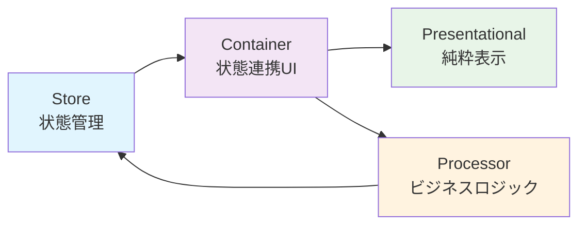

# PubSubTk

**PubSubTk**は、Pythonで「型安全」「疎結合」「宣言的UI」を実現する軽量GUIフレームワークです。

## ✨ 特長

- **Pub/Subパターン**による部品間の疎結合・テスタブル設計
- **Pydanticモデル**で型安全な状態管理とバリデーション
- **3層分離（Container / Presentational / Processor）**による保守性・再利用性
- **リアクティブUI**と柔軟な画面遷移
- **StateProxy**によるIDE連携（補完・定義ジャンプ・リファクタリング◎）
- **Storybook**によるコンポーネント開発環境（分離開発・動的Knobコントロール）

## 🚀 クイックスタート

```bash
pip install git+https://github.com/vavavavavavavavava/pubsubtk
```

```python
from pubsubtk import TkApplication, ContainerComponentTk
from pydantic import BaseModel

class AppState(BaseModel):
    count: int = 0

class Main(ContainerComponentTk[AppState]):
    def setup_ui(self):
        import tkinter as tk
        self.label = tk.Label(self, text="0")
        self.label.pack()
        tk.Button(self, text="増やす", command=self.inc).pack()
    def setup_subscriptions(self):
        self.sub_state_changed(self.store.state.count, self.on_count)
    def on_count(self, _, new): self.label.config(text=str(new))
    def inc(self):
        state = self.store.get_current_state()
        self.pub_update_state(self.store.state.count, state.count + 1)

if __name__ == "__main__":
    app = TkApplication(AppState, title="Demo")
    app.switch_container(Main)
    app.run()
```

## 🏗️ アーキテクチャ



## 🎨 Storybook サポート

PubSubTkには、UIコンポーネントを独立して開発・テストできるStorybookが組み込まれています：

```python
from pubsubtk.storybook import story, StorybookApplication

@story("Button.Primary")
def primary_button_story(ctx):
    import tkinter as tk
    
    # 動的コントロール
    text = ctx.knob("text", str, "Click me!")
    size = ctx.knob("size", int, 12, range_=(8, 24))
    
    btn = tk.Button(ctx.parent, text=text.value, font=("", size.value))
    btn.pack(padx=20, pady=20)
    return btn

if __name__ == "__main__":
    app = StorybookApplication()
    app.run()
```

## 📚 まず読む

- [はじめに](getting-started.md)
- [レシピ集](cookbook.md)
- [実装サンプル](examples.md)
- [Storybookガイド](storybook-guide.md)
- [FAQ](faq.md)
