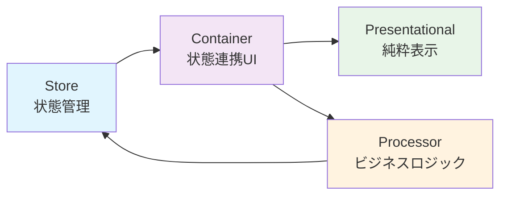

# PubSubTk

**PubSubTk** は、イベント駆動＆状態管理型の Python GUIアプリケーションを、型安全かつ疎結合で構築できる軽量ライブラリです。

## ✨ 特徴

- **UIとビジネスロジックの疎結合** - Publish/Subscribe（Pub/Sub）パターンによる非同期メッセージ連携
- **Pydanticモデル** による型安全な状態管理・バリデーション・JSON Schema出力
- **Container / Presentational / Processor** 3層分離パターンの標準化（Reactスタイル設計）
- **リアクティブUI更新** と **画面遷移管理** をサポート
- **StateProxy** による強力なIDE連携（補完・定義ジャンプ・リファクタリング対応）

## 🚀 クイックスタート

### インストール

```bash
pip install git+https://github.com/vavavavavavavavava/pubsubtk
```

### 最小構成の例

```python
from pydantic import BaseModel
from pubsubtk import TkApplication, ContainerComponentTk

class AppState(BaseModel):
    counter: int = 0
    message: str = "Hello PubSubTk!"

class MainContainer(ContainerComponentTk[AppState]):
    def setup_ui(self):
        import tkinter as tk
        
        # カウンター表示
        self.counter_label = tk.Label(self, text="0", font=("Arial", 24))
        self.counter_label.pack(pady=20)
        
        # ボタン
        tk.Button(self, text="カウント", command=self.increment).pack(pady=10)
        tk.Button(self, text="リセット", command=self.reset).pack()
    
    def setup_subscriptions(self):
        # カウンター変更を監視
        self.sub_state_changed(self.store.state.counter, self.on_counter_changed)
    
    def refresh_from_state(self):
        state = self.store.get_current_state()
        self.counter_label.config(text=str(state.counter))
    
    def on_counter_changed(self, old_value, new_value):
        self.counter_label.config(text=str(new_value))
    
    def increment(self):
        state = self.store.get_current_state()
        self.pub_update_state(self.store.state.counter, state.counter + 1)
    
    def reset(self):
        self.pub_update_state(self.store.state.counter, 0)

# アプリケーション起動
if __name__ == "__main__":
    app = TkApplication(AppState, title="PubSubTk Demo")
    app.switch_container(MainContainer)
    app.run()
```

## 📚 ドキュメント

- **[Getting Started](getting-started.md)** - インストールと基本的な使い方
- **[Examples](examples.md)** - 実用的なサンプルコード集
- **[API Reference](api/)** - 詳細なAPIドキュメント

## 🏗️ アーキテクチャ



## 🎯 主な用途

- **デスクトップGUIアプリケーション** - Tkinter/ttkベースの本格的なアプリ開発
- **プロトタイピング** - 状態管理が必要な画面遷移のあるアプリの迅速な開発
- **教育・学習** - Reactライクな設計パターンをPythonで学習
- **業務ツール** - データ処理・設定管理・監視ツールなどの内製ツール開発

## 💡 なぜPubSubTk？

従来のTkinterアプリケーション開発では、UIとビジネスロジックが密結合になりがちでした。PubSubTkは以下の問題を解決します：

- ❌ **状態管理の複雑さ** → ✅ Pydanticモデルで型安全な一元管理
- ❌ **コンポーネント間の密結合** → ✅ Pub/Subパターンで疎結合
- ❌ **画面遷移の煩雑さ** → ✅ 宣言的な画面切り替え
- ❌ **テストの困難さ** → ✅ 3層分離でテスタブルな設計
- ❌ **IDE支援の不足** → ✅ StateProxyで補完・ジャンプ・リファクタリング対応

## 🌟 StateProxyの威力

```python
# 従来の方法（型安全でない）
self.update_state("user.profile.name", "新しい名前")

# PubSubTk（型安全 + IDE支援）
self.pub_update_state(self.store.state.user.profile.name, "新しい名前")
#                     ↑ Ctrl+Click で定義にジャンプ
#                     ↑ 自動補完が効く
#                     ↑ リファクタリング時に自動追従
```

## 🤝 コントリビューション

PubSubTkはオープンソースプロジェクトです。バグレポート・機能要望・プルリクエストを歓迎します！

- **GitHub**: [https://github.com/vavavavavavavavava/pubsubtk](https://github.com/yourusername/pubsubtk)
- **Issues**: バグ報告・機能要望
- **Discussions**: 質問・アイデア・情報交換

---

**始めましょう！** → [Getting Started](getting-started.md)
