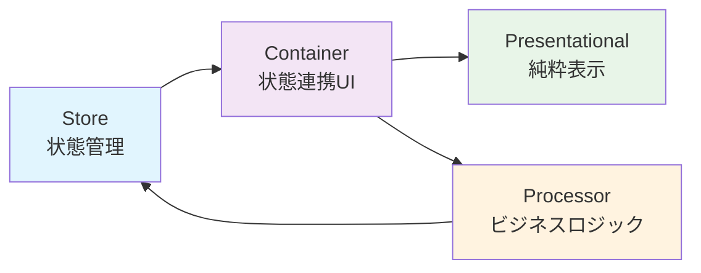

# PubSubTk

**PubSubTk**は、Pythonで「型安全」「疎結合」「宣言的UI」を実現する軽量GUIフレームワークです。

## ✨ 特長

- **Pub/Subパターン**による部品間の疎結合・テスタブル設計
- **Pydanticモデル**で型安全な状態管理とバリデーション
- **3層分離（Container / Presentational / Processor）**による保守性・再利用性
- **リアクティブUI**と柔軟な画面遷移
- **StateProxy**によるIDE連携（補完・定義ジャンプ・リファクタリング◎）
- **組み込みUndo/Redo**機能でフィールド単位の履歴管理が簡単

## 🚀 クイックスタート

```bash
pip install git+https://github.com/vavavavavavavavava/pubsubtk
```

```python
from pubsubtk import TkApplication, ContainerComponentTk
from pydantic import BaseModel

class AppState(BaseModel):
    count: int = 0

class Main(ContainerComponentTk[AppState]):
    def setup_ui(self):
        import tkinter as tk
        self.label = tk.Label(self, text="0")
        self.label.pack()
        tk.Button(self, text="増やす", command=self.inc).pack()
        
        # Undo/Redoボタンも簡単に追加
        self.undo_btn = tk.Button(self, text="Undo", command=self.undo)
        self.undo_btn.pack()
        
    def setup_subscriptions(self):
        # Undo/Redo機能を有効化
        self.pub_enable_undo_redo(self.store.state.count, max_history=20)
        
        self.sub_state_changed(self.store.state.count, self.on_count)
        self.sub_undo_status(self.store.state.count, self.on_undo_status)
        
    def on_count(self, _, new): 
        self.label.config(text=str(new))
        
    def on_undo_status(self, can_undo, can_redo, undo_count, redo_count):
        self.undo_btn.config(state="normal" if can_undo else "disabled")
        
    def inc(self):
        state = self.store.get_current_state()
        self.pub_update_state(self.store.state.count, state.count + 1)
        
    def undo(self):
        self.pub_undo(self.store.state.count)

if __name__ == "__main__":
    app = TkApplication(AppState, title="Demo")
    app.switch_container(Main)
    app.run()
```

## 🏗️ アーキテクチャ


```mermaid
graph LR
    Store[Store<br/>状態管理] --> Container[Container<br/>状態連携UI]
    Container --> Presentational[Presentational<br/>純粋表示]
    Container --> Processor[Processor<br/>ビジネスロジック]
    Processor --> Store
    
    style Store fill:#e1f5fe
    style Container fill:#f3e5f5
    style Presentational fill:#e8f5e8
    style Processor fill:#fff3e0
```

## 📚 まず読む

- [はじめに](getting-started.md)
- [レシピ集](cookbook.md)
- [実装サンプル](examples.md)
- [FAQ](faq.md)
